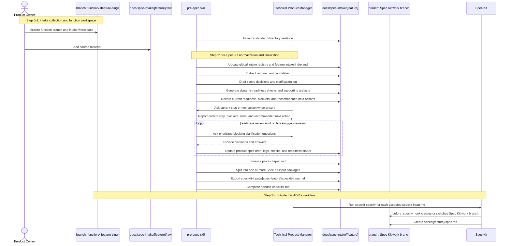
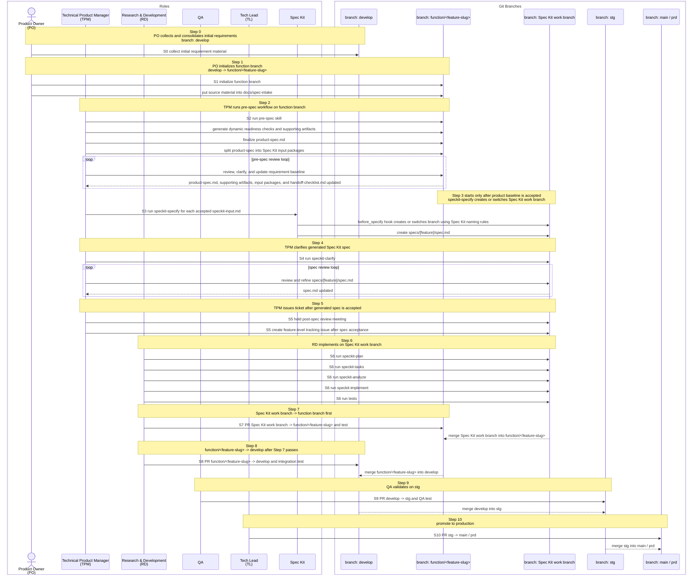
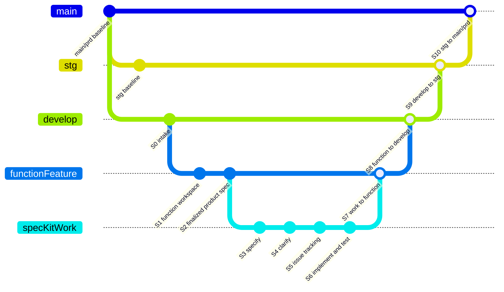

# ADR-0027: Pre-Spec Workflow for Spec Kit Intake

**Status:** Accepted
**Date:** 2026-05-04

## Amendment: Function Branch Creation Delegated to Init Script (2026-05-06)

The original decision used `prespec/<feature-slug>` as a git branch name. That
was imprecise: `prespec` is the workflow and skill behavior, not the branch
identity. This has been amended:

- `prespec_init.py` now creates and switches to `function/<feature-slug>`
  automatically.
- The base branch is locked to `develop` and cannot be overridden. Initializing from any
  other branch is rejected with an error.
- Before branching, the script fetches `origin/develop` and compares it with the local
  `HEAD`. If they differ, initialization is rejected to prevent branching from a stale
  base. If the remote is unreachable, the check is skipped with a warning.
- Pass `--no-branch` to skip branch creation when the branch already exists or branch
  creation is not needed.
- The script rejects initialization if the current branch is neither `develop` nor the
  target `function/<feature-slug>`, preventing accidental branching from wrong bases.
- This amendment does not change any other boundary: the pre-spec workflow still must
  not create Spec Kit artifacts or create/switch Spec Kit work branches.

## Amendment: Raw-Gated Artifact Skeleton During Initialization (2026-05-07)

Initialization now separates the empty intake workspace from the full review artifact
skeleton:

- `prespec_init.py` always creates or updates `docs/spec-intake/index.md` and
  `docs/spec-intake/<feature-slug>/raw/`.
- If no raw source material exists yet, the product/review artifacts are deferred so
  the workspace does not fill with placeholder-only `TBD` files.
- Once raw source material exists, or if any pre-spec artifact already exists,
  `prespec_init.py` creates the missing artifact skeleton from templates without
  overwriting existing files.
- Teams that need the full skeleton before raw files are available may pass
  `--with-artifacts`.

## Context

Spec Kit starts from a feature description and then creates `specs/[feature]/spec.md`,
clarifies requirements, plans implementation, generates tasks, and executes those tasks.
That works well after a feature boundary is known, but it is not the right place to
process raw product input such as meeting notes, customer requests, screenshots, Slack
summaries, and partially conflicting stakeholder statements.

The project needs a workflow before Spec Kit that turns product intake into a stable,
reviewed requirement baseline. In this workflow, `prespec` means the requirement
normalization workflow and readiness state, not a git branch identity.

## Decision

Introduce a pre-spec workflow, supported by a dedicated Codex skill, that runs only up
to Step 2 of the product/spec pipeline:

- Step 0: Product Owner collects and consolidates initial requirement material.
- Step 1: Product Owner initializes the `function/<feature-slug>` branch and intake
  workspace.
- Step 2: TPM uses the pre-spec skill to normalize, clarify, and finalize requirements.
- Step 3 and later: Spec Kit takes over. `speckit-specify` consumes the exported
  input, and its `before_specify` git hook creates or switches to a Spec Kit work
  branch. The actual work branch name is controlled by Spec Kit's own branch naming
  rules.

Branch naming model:

- `develop`: integration base branch for feature intake.
- `function/<feature-slug>`: product baseline and integration branch for the feature
  or module. Pre-spec artifacts are produced here.
- Spec Kit work branch: branch created or switched by Spec Kit's `before_specify`
  hook for a specific accepted `speckit-input.md`. ADR-0027 does not define its
  actual branch name.

The pre-spec skill produces inputs for Spec Kit. It must not create Spec Kit artifacts,
must not write `specs/[feature]/spec.md`, and must not write `.specify/feature.json`.
Those remain the responsibility of `speckit-specify`.

## Role Responsibilities

| Role | Pipeline Scope | Responsibilities |
|------|----------------|------------------|
| Product Owner (PO) | Step 0-1 | Collect initial requirement material, identify business context and priority, provide the feature slug, initialize the `function/<feature-slug>` branch and intake workspace, and provide raw source material under `docs/spec-intake/[feature]/raw/`. |
| Technical Product Manager (TPM) | Step 2-5 | Own requirement finalization on `function/<feature-slug>`, operate the pre-spec workflow, resolve blocking clarifications, approve `product-spec.md`, hand off one or more `speckit-input.md` files to Spec Kit, clarify generated `spec.md`, hold the post-spec review meeting, and create feature-level tracking tickets after the generated spec is accepted. |
| Research & Development (RD) | Step 6-8 | Own implementation on the Spec Kit work branch, run Spec Kit planning/task/implementation flows, execute tests, and prepare PRs from the Spec Kit work branch to `function/<feature-slug>` and then from `function/<feature-slug>` to `develop`. |
| QA | Step 9 | Validate the integrated change on `stg`, run QA acceptance checks, and block promotion if behavior does not match the accepted requirement baseline. |
| Tech Lead (TL) | Step 10 | Review production readiness, confirm release quality gates, and promote from `stg` to `main / prd`. |
| Pre-spec skill | Step 1-2 | During initialization, create or switch only `function/<feature-slug>` from `develop`; create or normalize the intake directory skeleton; normalize raw material; maintain intermediate artifacts; classify gaps; recommend next actions; generate `product-spec.md`; export one or more Spec Kit input packages; and complete `handoff-checklist.md`. It does not approve requirements, create Spec Kit artifacts, or create/switch Spec Kit work branches. |
| Spec Kit skills | Step 3-6 | Convert each `speckit-input.md` into Spec Kit artifacts, decide the Spec Kit work branch name through Spec Kit's branch rules, create or switch to that branch through the `before_specify` git hook, clarify the generated spec, create the implementation plan, generate tasks, analyze artifact consistency, and execute implementation tasks. |

## Skill Coverage

ADR-0027 requires one dedicated pre-spec skill before Spec Kit and then uses the
existing Spec Kit skills after handoff. The skill boundary is part of the decision:
pre-spec work produces accepted input for Spec Kit, while Spec Kit work creates and
evolves implementation-facing artifacts.

| Skill | Status | Pipeline Scope | Responsibility |
|-------|--------|----------------|----------------|
| `prespec` | Required new skill | Step 1-2 | Maintain `docs/spec-intake/index.md`, normalize `docs/spec-intake/[feature]/`, report the current pre-spec step and next action, index raw material, extract candidate requirements, maintain clarification and scope decisions, classify feature traits, generate dynamic readiness checks, create required supporting artifacts, draft and refine `product-spec.md`, export accepted `speckit-input.md` packages, and complete `handoff-checklist.md`. |
| `speckit-specify` | Existing skill | Step 3 | Consume one accepted `spec-kit-inputs/[spec-feature]/speckit-input.md`, create or update `specs/[feature]/spec.md`, and write `.specify/feature.json`; branch creation or switching is handled by the `before_specify` hook. |
| `speckit-clarify` | Existing skill | Step 4 | Clarify the generated `spec.md` after `speckit-specify` and encode accepted clarifications into Spec Kit artifacts. |
| `speckit-plan` | Existing skill | Step 6 | Generate implementation planning artifacts from the accepted Spec Kit specification. |
| `speckit-tasks` | Existing skill | Step 6 | Generate dependency-ordered implementation tasks from the Spec Kit plan and supporting artifacts. |
| `speckit-analyze` | Existing skill | Step 6 | Analyze consistency and quality across `spec.md`, `plan.md`, and `tasks.md` before implementation. |
| `speckit-implement` | Existing skill | Step 6 | Execute implementation tasks on the Spec Kit work branch. |
| `speckit-taskstoissues` | Existing optional skill | After task generation | Convert generated task breakdowns into issue trackers when the team wants task-level issue tracking; it is not a substitute for TPM's Step 5 feature-level tracking ticket unless adapted for that purpose. |
| `speckit-checklist` | Existing optional skill | Spec Kit artifact review | Generate additional checklists for Spec Kit artifacts when needed; it does not replace `prespec` dynamic readiness checks for `product-spec.md`. |

Skill sequencing rules:

- PO starts from `develop` and initializes the `function/<feature-slug>` branch and
  raw intake workspace before Step 2 normalization continues.
- `prespec` must finish `handoff-checklist.md` before any accepted input package is
  passed to `speckit-specify`.
- `speckit-specify` runs once per accepted `speckit-input.md` package.
- No Spec Kit skill may approve or mutate `product-spec.md` as the source requirement
  baseline.
- `prespec` may draft and refine `product-spec.md`, but it must not set `Status:
  Accepted` without PO/TPM acceptance evidence.
- `prespec` must not write `specs/[feature]/spec.md`, `.specify/feature.json`, or
  create/switch Spec Kit work branches.

Pre-spec automation helpers:

| Helper | Responsibility |
|--------|----------------|
| `prespec_init.py` | Create or switch to `function/<feature-slug>` from `develop`, then create or update the global registry and feature `raw/` workspace. Create the full artifact skeleton from templates after raw source material exists, when artifacts already exist, or when `--with-artifacts` is passed. |
| `prespec_status.py` | Report current ADR-0027 step, current status, completed items, blockers, non-blocking risks, and recommended next action. |
| `prespec_sync_index.py` | Synchronize `docs/spec-intake/index.md` from feature artifacts using conservative status rules. |
| `prespec_validate.py` | Validate mechanical gate consistency before handoff. |

## Workflow



## Pre-Spec Skill Operating Model

The pre-spec skill operates as an iterative requirement readiness assistant for PO and
TPM. After PO places raw source material under `docs/spec-intake/[feature]/raw/`, the
skill must inspect the intake workspace, identify what is already known, identify what
is missing, recommend the next actions, and record the current progress toward an
acceptable `product-spec.md`.

The operating loop is:

```text
PO/TPM asks current status
-> skill reports current step, blockers, risks, and recommended next action

PO adds raw source material
-> skill indexes sources
-> skill extracts candidate requirements
-> skill classifies feature traits and dynamic readiness checks
-> skill identifies missing content, conflicts, and unresolved decisions
-> skill recommends next actions and asks prioritized blocking questions
-> PO/TPM provides answers or decisions
-> skill updates product-spec.md, supporting artifacts, logs, and handoff status
-> repeat until product-spec.md is ready for PO/TPM acceptance
```

The skill must make the current state visible rather than only producing a final
document. It records progress and gaps through:

- `docs/spec-intake/index.md`: global registry of all pre-spec intake workspaces.
- `docs/spec-intake/[feature]/intake-index.md`: source inventory and processing
  status for the current feature only.
- `extracted-requirements.md`: candidate requirements and source traceability.
- `clarification-log.md`: blocking questions, resolved answers, assumptions,
  conflicts, and non-blocking/deferred/out-of-scope decisions.
- `scope-decision.md`: in-scope, out-of-scope, deferred, and split-feature decisions.
- `supporting-artifacts/readiness-checks.md`: feature traits, required supporting
  artifacts, completion status, N/A rationale, and missing artifact gaps.
- `handoff-checklist.md`: current Step 2 readiness, blocking status, and handoff gate
  completion.

Each readiness review should surface a concise status summary containing:

- Current ADR-0027 step.
- Current status.
- Completed items.
- Blocking gaps.
- Non-blocking risks or deferred items.
- Required PO/TPM decisions.
- Recommended next actions.

The skill may propose defaults, draft requirement language, create supporting
artifacts, and recommend how to close gaps. It must not mark `product-spec.md` as
`Accepted` unless PO/TPM acceptance evidence is provided. The skill also must not
create Spec Kit artifacts, write `.specify/feature.json`, or create/switch Spec Kit
work branches.

Clarification questions should be batched by review cycle and prioritized by
downstream impact. A review cycle should normally ask no more than five blocking
questions, prioritizing scope, failure behavior, external integration, permission or
security impact, and measurable success criteria.

### Status And Next-Step Mode

The pre-spec skill must support a status mode so PO/TPM do not need to know the full
workflow before using it. When asked what to do next, the skill reports the earliest
blocking step and the next concrete action instead of requiring the user to name a
specific artifact.

Status mode must be available for both scopes:

- Global board scope: summarize `docs/spec-intake/index.md` and list feature
  workspaces.
- Feature scope: inspect `docs/spec-intake/[feature]/` and report the feature's
  current step.

Feature status output must include:

- `Current Step`, such as Step 0-1 intake collection, Step 2 source indexing, Step 2
  requirement extraction, Step 2 clarification review, Step 2 dynamic readiness,
  Step 2 product spec review, Step 2 Spec Kit input split, Step 2 handoff checklist,
  or ready for Step 3 `speckit-specify`.
- `Current Status`, such as Draft, Blocked, In Review, or Ready.
- Completed items.
- Blocking gaps.
- Non-blocking risks.
- Recommended next step.

The status decision should use the earliest blocking step as the primary current
step. For example, if raw material has not been added yet, status should point to
intake collection even if downstream files also contain placeholders.

## Intake Index Model

The workflow uses two index levels:

- `docs/spec-intake/index.md` is the global intake workspace registry. It tracks all
  pre-spec workspaces at summary level only.
- `docs/spec-intake/[feature]/intake-index.md` is the per-feature raw source
  inventory. It tracks source-level details only for that feature.

The global registry must not duplicate raw source detail from feature workspaces. It
records status and navigation information so PO/TPM can see the current pre-spec
board without opening every feature folder.

Recommended `docs/spec-intake/index.md` fields:

| Field | Purpose |
|-------|---------|
| Feature Slug | Directory name under `docs/spec-intake/` |
| Title | Human-readable feature name |
| Status | Draft, Blocked, In Review, Ready, Accepted, or Handoff Complete |
| PO | Product owner |
| TPM | Technical product manager |
| Product Spec | Link to `[feature]/product-spec.md` |
| Handoff Checklist | Link to `[feature]/handoff-checklist.md` |
| Last Updated | Last registry update date |
| Notes | Short status, blocker, or handoff note |

Recommended `docs/spec-intake/[feature]/intake-index.md` fields:

| Field | Purpose |
|-------|---------|
| Source ID | Stable source identifier, such as `SRC-001` |
| Source | File path or durable reference |
| Type | Meeting note, customer request, screenshot, Slack/email summary, existing document, or clarification answer |
| Owner | Source owner or stakeholder |
| Source Date | Date when known |
| Status | New, Indexed, Extracted, Needs Review, Resolved, or Rejected |
| Notes | Source-specific quality, context, or conflict note |

## Full Product/Spec Pipeline

This ADR decides the Step 0-2 pre-spec workflow. The full pipeline is recorded here
to show how the finalized `product-spec.md` and exported Spec Kit input packages hand
off into Spec Kit and later branch promotion gates.

### Full Pipeline Sequence



### Full Pipeline Git Graph

This graph shows one accepted Spec Kit input package. When `product-spec.md` is split
into multiple accepted input packages, Step 3 and later repeat per package. The
`functionFeature` and `specKitWork` names are graph aliases: the actual product
baseline branch is `function/<feature-slug>`, while the actual Spec Kit work branch
name is generated by Spec Kit's existing branch naming rules.



## Artifact Model

The workflow distinguishes raw materials, intermediate artifacts, and deliverables.

### Artifact Transformation Flow

The pre-spec workflow transforms raw intake material into a finalized product
requirement baseline, then exports a Spec Kit-ready input:

```text
docs/spec-intake/index.md
-> register or update feature workspace status

raw/
-> docs/spec-intake/[feature]/intake-index.md
-> extracted-requirements.md
-> clarification-log.md + scope-decision.md
-> supporting-artifacts/readiness-checks.md + required supporting artifacts
-> product-spec.md
-> spec-kit-inputs/[spec-feature]/speckit-input.md
-> speckit-specify for each accepted input
```

`product-spec.md` is the finalized requirement document for PO/TPM and stakeholders.
Each `spec-kit-inputs/[spec-feature]/speckit-input.md` is a distilled, single-feature
input derived from `product-spec.md` for `speckit-specify`. It should omit
meeting-note noise, rejected options, unresolved contradictions, and governance
history that does not help Spec Kit generate a clear feature specification.

One `product-spec.md` may produce multiple Spec Kit input packages. Each package is
managed independently after handoff because `speckit-specify` creates independent
Spec Kit artifacts and work branch state for each accepted input.

### Raw Materials

Raw materials are inputs supplied by PO or stakeholders:

- Original requirement material: notes, meeting minutes, customer text, screenshots,
  Slack/email summaries, and existing documents.
- Business context: problem statement, target users, value, priority, and timing.
- Existing constraints and references: current behavior, domain rules, compliance
  limits, integration notes, and technical boundaries that shape scope.
- Clarification answers: PO/TPM decisions produced during the review loop.

### Intermediate Artifacts

Intermediate artifacts are working material used to make requirements reviewable:

- `docs/spec-intake/index.md`: global registry of all pre-spec workspaces and their
  summary status.
- `intake-index.md`: per-feature source inventory and processing state.
- `extracted-requirements.md`: candidate requirements extracted from raw input.
- `scope-decision.md`: in-scope, out-of-scope, and split-feature decisions.
- `clarification-log.md`: open questions, resolved answers, assumptions, and conflicts.

### Deliverables

The pre-spec workflow has five deliverable groups:

- `product-spec.md`: finalized human-readable requirement baseline for PO/TPM review.
- `supporting-artifacts/`: dynamically required supporting requirement artifacts, such
  as workflow diagrams, sequence diagrams, API contracts, integration notes,
  permission matrices, data model notes, error-handling matrices, and operational
  recovery notes.
- `spec-kit-inputs/[spec-feature]/speckit-input.md`: clean, single-feature input for
  `speckit-specify`; repeatable when one product spec is split into multiple Spec Kit
  features.
- `spec-kit-inputs/index.md`: mapping of generated input packages to their scope,
  status, source decisions, and expected Spec Kit handoff order.
- `handoff-checklist.md`: readiness gate confirming the feature can move to Step 3.

## Directory Convention

PO owns the feature slug and initial intake workspace. The pre-spec skill owns
normalizing the directory skeleton, updating the global registry, and generating files
after the workspace exists. TPM owns requirement finalization decisions.

```text
docs/spec-intake/
├── index.md
└── [feature]/
    ├── raw/
    ├── intake-index.md
    ├── extracted-requirements.md
    ├── clarification-log.md
    ├── scope-decision.md
    ├── product-spec.md
    ├── supporting-artifacts/
    │   ├── readiness-checks.md
    │   └── [artifact].md
    ├── spec-kit-inputs/
    │   ├── index.md
    │   └── [spec-feature]/
    │       └── speckit-input.md
    └── handoff-checklist.md
```

Responsibilities:

| Item | Owner | Responsibility |
|------|-------|----------------|
| `docs/spec-intake/index.md` | pre-spec skill + TPM | Track all pre-spec workspaces at summary level |
| `docs/spec-intake/[feature]/` | PO + pre-spec skill | PO provides the feature slug and creates the workspace; the skill normalizes the skeleton and generated files |
| `raw/` contents | PO | Provide source material |
| `intake-index.md` | pre-spec skill + TPM | Track raw source material for the current feature only |
| Intermediate artifacts | pre-spec skill + TPM | Extract, normalize, and decide requirement scope |
| `product-spec.md` | TPM, assisted by skill | Finalized requirement baseline |
| `supporting-artifacts/` | pre-spec skill + TPM | Problem-specific requirement artifacts required by dynamic readiness checks |
| `spec-kit-inputs/index.md` | pre-spec skill + TPM | Track each generated Spec Kit input package and its handoff status |
| `spec-kit-inputs/[spec-feature]/speckit-input.md` | pre-spec skill | Export Spec Kit-ready feature description for one generated Spec Kit feature |
| `handoff-checklist.md` | pre-spec skill + TPM | Confirm readiness for Step 3 |

## Handoff Rules

The pre-spec workflow is complete only when:

- The product requirement baseline is finalized in `product-spec.md`.
- The product spec has been split into one or more Spec Kit input packages, with split
  decisions recorded in `spec-kit-inputs/index.md`.
- Each generated input package has a single Spec Kit feature boundary.
- No blocking clarification remains open.
- MVP scope is explicit.
- Acceptance scenarios are sufficient for `speckit-specify`.
- Success criteria are measurable enough to survive `speckit-clarify`.
- Required dynamic readiness checks are complete, and any not-applicable supporting
  artifact has an explicit rationale.
- Relevant failure behavior is defined, or the product spec explicitly states that
  the feature introduces no user-visible or workflow-visible failure behavior.
- Each `speckit-input.md` contains no meeting-note noise or unresolved contradictions.

After handoff, TPM runs `speckit-specify` once per accepted
`spec-kit-inputs/[spec-feature]/speckit-input.md`. Branch creation and branch naming
are owned by the Spec Kit `before_specify` git hook, not by the pre-spec skill or this
ADR.

Step 5 ticket creation happens only after `speckit-specify` creates `spec.md`,
`speckit-clarify` completes, and the post-spec review meeting accepts the generated
Spec Kit specification.

## Template and Approval Designs

### `product-spec.md` Acceptance Model

`product-spec.md` is the PO/TPM-facing finalized requirement baseline. It may be
accepted only when it satisfies both the common content baseline and the dynamic
readiness checks selected for the problem being solved.

The acceptance model is:

```text
product-spec.md acceptance
= common content readiness rules
+ dynamic problem-specific readiness checks
+ explicit N/A rationale for checks that do not apply
+ approval header and durable acceptance evidence
```

The pre-spec skill must classify the feature from the intake material, generate the
required readiness checks, and keep those checks traceable from `product-spec.md` and
`handoff-checklist.md`. Dynamic checks are mandatory once generated; they are not
optional review suggestions.

### `product-spec.md` Content Readiness Rules

A `product-spec.md` may be accepted only when:

- The problem, goal, target actors, business context, and priority are explicit.
- MVP scope is clearly separated from out-of-scope and deferred work.
- Functional requirements are written as product behavior, not implementation tasks.
- Acceptance scenarios cover the primary paths and relevant exception paths.
- Success criteria are observable or measurable.
- Constraints, assumptions, dependencies, and relevant domain rules are recorded.
- All blocking clarifications are resolved.
- Remaining open items are explicitly marked non-blocking, deferred, or out of scope.
- Scope decisions are traceable to source material, clarification answers, or PO/TPM
  decisions.
- Relevant failure behavior is defined, or the product spec explicitly states that
  the feature introduces no user-visible or workflow-visible failure behavior.
- The spec can be split into one or more single-feature Spec Kit inputs without
  unresolved contradictions.

### Dynamic Product Spec Readiness Checks

`product-spec.md` acceptance uses a common baseline plus dynamically selected
problem-specific checks. The pre-spec skill must classify the feature traits and
generate `supporting-artifacts/readiness-checks.md` before `product-spec.md` can be
accepted.

The generated checks must identify which supporting artifacts are required, optional,
or not applicable. Any not-applicable decision must include a short rationale.

Problem-specific checks include:

| Feature trait | Required supporting artifact or section |
|---------------|------------------------------------------|
| Multi-role, multi-system, or multi-step workflow | Workflow diagram or sequence diagram |
| Async job, callback, event handling, or state transition | Sequence diagram and state transition model |
| New or changed external/internal API behavior | API contract or API design note |
| Third-party or cross-system integration | Integration note, data mapping, timeout/retry semantics, and failure behavior |
| New or changed data lifecycle | Data model note, retention rule, migration note, or compatibility note |
| Permission, role, or approval behavior | Permission matrix or approval flow |
| Security, privacy, compliance, or audit concern | Security/privacy requirements and audit expectations |
| Import, export, or batch processing | Validation rules, partial failure policy, and recovery behavior |
| High-risk, irreversible, payment, order, or control flow | Idempotency expectations, compensation behavior, and audit trail requirements |
| Operationally sensitive behavior | Observability, alerting, and manual recovery note |

A required supporting artifact may live under `supporting-artifacts/` or as a clearly
named section in `product-spec.md`. Large or reusable material should live under
`supporting-artifacts/` and be linked from `product-spec.md`.

`product-spec.md` must include a supporting-artifact summary:

```markdown
## Required Supporting Artifacts

| Artifact | Required | Status | Link | Rationale |
|----------|----------|--------|------|-----------|
| Sequence Diagram | Yes | Complete | supporting-artifacts/sequence.md | Feature spans backend and external callback |
| API Contract | Yes | Complete | supporting-artifacts/api-contract.md | New endpoint behavior is required |
| Permission Matrix | No | N/A | N/A | No role-specific behavior change |
```

### Error Handling Readiness

Error handling is part of product-spec acceptance. The pre-spec workflow must define
product-level failure behavior for relevant failure cases and defer implementation
mechanics to later Spec Kit planning unless the mechanics are themselves product,
SLA, compliance, or integration constraints.

Product-level error handling requirements include:

- The business state after failure, such as failed, pending, partially complete, or
  rolled back.
- User, operator, or system feedback.
- Recovery path, such as retry, edit and resubmit, manual reconciliation, or support
  escalation.
- Ownership of manual follow-up when automated recovery is insufficient.
- Audit, notification, and evidence requirements when the domain requires them.

An error-handling matrix or equivalent section is required when the feature includes
external integrations, async processing, state transitions, import/export, batch
processing, permission-sensitive behavior, or high-risk irreversible flows.

Example matrix:

```markdown
## Error Handling Requirements

| Failure Case | Expected Product Behavior | User/System Feedback | Recovery Path | Blocking? |
|--------------|---------------------------|----------------------|---------------|-----------|
| External service timeout | Mark request as pending | Show pending status to operator | Retry from request detail | Yes |
| Duplicate submission | Do not create a duplicate request | Show existing request reference | Navigate to existing request | Yes |
```

### `product-spec.md` Approval Header

`product-spec.md` must carry an explicit approval header so downstream agents and
reviewers can tell whether the document is still a draft or ready for Spec Kit input
export.

Required header:

```markdown
# Product Spec: [Feature Name]

**Status:** Draft | In Review | Accepted
**Feature Slug:** [feature]
**Function Branch:** function/[feature]
**Product Owner:** [name]
**TPM:** [name]
**Accepted At:** YYYY-MM-DD or N/A
**Acceptance Evidence:** [meeting note / PR review / checklist reference]
```

Approval rules:

- `Status` must be `Accepted` before any `speckit-input.md` is handed off.
- PO and TPM must both be named in the approval header.
- `Acceptance Evidence` must point to a durable record, such as a meeting note,
  PR review, or `handoff-checklist.md` approval item.
- Common content readiness rules and all required dynamic readiness checks must be
  complete before acceptance.
- Any remaining open question in `clarification-log.md` must be explicitly marked
  non-blocking, deferred, or out of scope.
- If `product-spec.md` or any required supporting artifact is later changed after
  acceptance, status returns to `In Review` until PO/TPM acceptance is recorded
  again.

### `speckit-input.md` Template

Each `spec-kit-inputs/[spec-feature]/speckit-input.md` is a distilled input for one
Spec Kit feature. It must be self-contained enough for `speckit-specify`, but it
must not include review history, rejected options, meeting-note noise, or unresolved
contradictions.

Required structure:

```markdown
# Spec Kit Input: [Spec Feature Name]

**Status:** Draft | Accepted
**Source Product Spec:** ../../product-spec.md
**Source Scope Decision:** ../../scope-decision.md
**Spec Feature Slug:** [spec-feature]
**Handoff Order:** [number]

## Feature Summary

[One concise paragraph describing the feature.]

## Actors

- [Actor]: [goal / role in this feature]

## Problem and Goal

[Problem this feature solves and the user/business outcome expected.]

## In Scope

- [Scope item included in this Spec Kit feature]

## Out of Scope

- [Scope item explicitly excluded or handled by another input package]

## User Scenarios

1. [Primary scenario]
2. [Secondary scenario, if needed]

## Functional Requirements

- [Testable requirement]

## Success Criteria

- [Measurable outcome]

## Constraints and Assumptions

- [Constraint or assumption relevant to specification]

## Source Decisions

- [Decision from product-spec.md, scope-decision.md, or clarification-log.md]
```

Handoff rules for each input:

- `Status` must be `Accepted`.
- The input must describe exactly one Spec Kit feature boundary.
- Cross-feature dependencies must be stated in `In Scope`, `Out of Scope`, or
  `Source Decisions`.
- Requirements must be product/specification language, not implementation tasks.
- The input must link back to `product-spec.md` and relevant source decisions.

### `handoff-checklist.md` Template

`handoff-checklist.md` is the readiness gate for moving from Step 2 to Step 3. It
must include both product-level checks and per-input-package checks.

Required structure:

```markdown
# Pre-Spec Handoff Checklist: [Feature Name]

**Feature Slug:** [feature]
**Product Spec:** product-spec.md
**Spec Kit Inputs Index:** spec-kit-inputs/index.md
**Status:** Draft | Ready | Blocked

## Product Baseline

- [ ] `docs/spec-intake/index.md` lists this feature workspace
- [ ] `product-spec.md` status is `Accepted`
- [ ] PO and TPM approval are recorded in `product-spec.md`
- [ ] All raw source material for this feature is listed in `intake-index.md`
- [ ] Blocking questions in `clarification-log.md` are resolved
- [ ] In-scope and out-of-scope decisions are recorded in `scope-decision.md`
- [ ] `product-spec.md` includes the required supporting-artifact summary
- [ ] Relevant failure behavior is defined, or explicitly marked not applicable

## Dynamic Readiness Checks

- [ ] `supporting-artifacts/readiness-checks.md` has been generated
- [ ] Feature traits and required supporting artifacts are recorded
- [ ] Every required supporting artifact is complete and linked from `product-spec.md`
- [ ] Every not-applicable artifact has an explicit rationale
- [ ] Error-handling matrix or equivalent section is complete when required

## Spec Kit Input Packages

- [ ] `spec-kit-inputs/index.md` lists every generated input package
- [ ] Each input package has exactly one Spec Kit feature boundary
- [ ] Each accepted `speckit-input.md` has `Status: Accepted`
- [ ] Each accepted `speckit-input.md` links back to source decisions
- [ ] Handoff order is recorded for accepted input packages

## Handoff Approval

- [ ] TPM confirms accepted input packages are ready for `speckit-specify`
- [ ] PO confirms the split from product spec to Spec Kit inputs is acceptable
- [ ] No accepted input contains unresolved contradictions or meeting-note noise

## Notes

- [Any remaining non-blocking risks, deferred items, or follow-up notes]
```

Checklist status rules:

- `Status: Ready` requires every checkbox outside `Notes` to be checked.
- `Status: Blocked` is required when any blocking clarification remains open.
- `Status: Blocked` is required when any required dynamic readiness check remains
  incomplete.
- Only input packages with `Status: Accepted` may be handed off to
  `speckit-specify`.

## Consequences

**Positive:**
- Spec Kit receives cleaner, single-feature input with fewer contradictions.
- Product review happens before implementation artifacts are created.
- Raw stakeholder input remains traceable through per-feature `intake-index.md` and
  `clarification-log.md`.
- `prespec` becomes a stable requirement baseline, reducing scope drift between PO,
  TPM, and RD.

**Negative:**
- The team must maintain another documentation workspace before `specs/`.
- PO and TPM must follow the directory convention for the skill to operate reliably.
- Some ambiguity can still remain for `speckit-clarify`; the workflow reduces that
  load but does not replace Spec Kit clarification.

## Alternatives Considered

- **Run `speckit-specify` directly from raw PO input** - Rejected. It pushes intake
  cleanup and feature-boundary decisions into Spec Kit, where artifacts are already
  being created.
- **Build a full S0-S10 orchestration skill** - Rejected for now. The immediate gap is
  pre-Spec-Kit requirement finalization, not PR promotion or release management.
- **Require PO to manually create every file** - Rejected. The skill should create the
  skeleton so naming and handoff checks are consistent.

## See Also

- [ADR-0011](0011-qa-toolchain.md) - Quality gates after implementation planning
- [ADR-0022](0022-container-infrastructure.md) - CI and container quality gate context
- [Pre-Spec Workflow Runbook](../runbooks/pre-spec-workflow.md) - PO/TPM operating steps for `$prespec`
- `.agents/skills/prespec/SKILL.md` - Pre-Spec workflow that prepares the accepted product baseline and Spec Kit inputs
- `.agents/skills/speckit-specify/SKILL.md` - Spec Kit command that consumes the exported input
- `.agents/skills/speckit-clarify/SKILL.md` - Spec Kit clarification after specification
