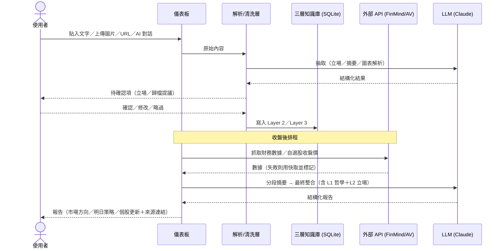

# Product Spec: AlphaVibe 投資資訊儀表板

**Status:** Accepted
**Feature Slug:** alphavibe
**Function Branch:** function/alphavibe
**Product Owner:** Stander
**TPM:** Stander
**Accepted At:** 2026-07-08
**Acceptance Evidence:** PO Stander 於 2026-07-08 Claude Code session 回覆「依照你的建議」完成驗收，併同確認 Q-024（AI 對話輸入納入 v1）與 Q-027（全域投資助理列 Deferred）；證據記錄於 clarification-log.md Q-024/Q-027
**Last Updated:** 2026-07-08

> 追溯慣例：本文件每項敘述標注來源——SRC-001／SRC-002 為 raw 素材
> （見 intake-index.md），Q-0xx 為澄清決策（見 clarification-log.md）。

---

## 1. Overview（問題、目標與價值）

AlphaVibe 是台股為主、兼顧美股的個人投資資訊儀表板（SRC-001 §1）。

- **問題**：投資資訊分散在 LINE、Email、Facebook、財經網站、YouTube，每日
  手動彙整約需 1 小時，耗時且易遺漏；且缺乏能長期累積、支撐選股與交易
  決策的個人資料庫（SRC-001 §1、§2；Q-001；SRC-009 §1）。
- **核心迴圈（2026-07-07 主軸重塑，SRC-009、Q-029）**：與 AI 討論各來源
  資訊並歸檔 → 從基本面浮現目標股（名單驅動＋哲學驅動，Q-030）→ 估值討論
  （先基本面好、再談買賣價）→ 進出決策 → 記錄預計/實際進出場（後行）。
- **支援能力**：每日收盤後彙整報告（市場方向＋明日策略＋個股更新）；
  覆盤時間 1 小時 → 10 分鐘內的效率目標維持（SRC-001 §1、§2；Q-029）。
- **引擎**：Claude 主力（聊天思考）＋ Cline 輔助（爬蟲等簡單工作），
  不自建內嵌 LLM 的產品；本地資料庫承載（local-first）（Q-032）。
- **即時性**：不要求即時（Q-003）。**優先級**：P0 核心工具（SRC-001 §2）。

### 三層知識庫（產品資訊架構，Q-013、Q-015）

| 層 | 內容 | 更新頻率 | 儲存形態 |
|----|------|----------|----------|
| Layer 1 哲學庫 | 于志宇哲學／股癌筆記／定錨報告三個獨立模組 | 慢變 | 配置目錄 `.md` 檔，啟動時拼接進 AI system prompt（SRC-001 §1、FR-014） |
| Layer 2 個股立場 | {code, name, stance, reason, date, entry_condition, valuation_metric, time_horizon, risk_factor, source_ref} | 每週 | SQLite 結構化表，LLM 抽取＋人工確認（FR-003、Q-009） |
| Layer 3 每日評論 | 清洗後的每日訊息 | 每日 | SQLite FTS5 全文檢索（Q-015） |

## 2. 目標使用者（Actors）

| Actor | 目標 | 備註 |
|-------|------|------|
| Core User（Stander 本人） | 收盤後高效覆盤、制定明日交易計畫 | 主要使用者（SRC-001 §3） |
| Secondary User（受信任朋友） | 取得分析後的市場觀點 | 小規模；v1 不含多用戶管理（SRC-001 §3、§4b） |

## 3. 範圍摘要

完整範圍決策見 `scope-decision.md`。摘要：

- **v1 In-Scope**：手動貼入三來源＋YouTube（FR-023）、三層知識庫、
  FinMind/AV 數據、URL 爬取與圖片解析、**名單驅動＋哲學驅動選股與估值討論
  （FR-019~021，Q-029/Q-030）**、儀表板（總覽名單＞資訊流優先，FR-024/025、
  Q-031）、每日報告（支援能力）、自選股、觸價提醒、立場衝突標記、前置清洗、
  **AI 對話式輸入（FR-015~018，Q-024 已於 2026-07-08 確認納入）**。
- **後行階段（in scope、非 v1 首發）**：交易紀錄——預計/實際進出場
  （FR-022，Q-029）。
- **Out-of-Scope**：持倉追蹤（成本/損益；FR-022 進出場紀錄不屬此排除，
  邊界見 SRC-009 OQ-2）、自動爬取/n8n、照片自動解析、自動通知、
  多用戶管理、歷史對話自動匯入（Q-023）。
- **Deferred**：**全市場條件篩選選股（Q-030）**、全域投資助理（Q-019 v1
  不做；Q-027 於 2026-07-08 定案列 Deferred）、Docker 雲端部署（Q-032）、
  n8n 自動化、持倉、通知、Feedback Loop、多用戶權限、
  來源權重邏輯、對話歷史保存策略、LLM 用量邊界（Q-025）。

## 4. User Scenarios 與驗收情境

### 場景 1 — 每日覆盤（Happy Path，SRC-001 §6）

1. 收盤後，使用者將今日 LINE／定錨／股癌內容貼入系統，上傳關注的市場
   截圖，提供 2–3 個財經網頁 URL 觸發爬取。
2. 系統呼叫 FinMind/Alpha Vantage 取得數據；Vision LLM 非同步解析截圖；
   LLM 對 Layer 3 原始資料分段摘要。
3. 系統結合 Layer 1–3 與外部數據產出結構化報告：市場總體方向 → 明日
   操作策略 → 自選股重點更新（第一區：自選股新消息；第二區：其他提及股票）。
4. 使用者檢視報告，對有疑問的結論點連結回溯原始來源，完成明日交易計畫。

**驗收**：貼入樣本資料後能產出含上述三段結構與兩區呈現的報告；報告中
每個結論可點回來源片段（FR-004、FR-006、FR-007）。

### 場景 2 — AI 對話式輸入（SRC-002；Q-019~Q-021）

1. 使用者在儀表板切到「AI 對話」輸入（與文字貼入／URL／圖片並列）。
2. 使用者以自然語言討論投資想法或口述盤後心得。
3. AI 從對話中萃取可歸檔內容，即時提出「歸檔提議」：目標層級（L1/L2/L3）
   ＋內容摘要。
4. 使用者對每筆提議選擇：確認入庫／修改後入庫／略過。確認後寫入對應層，
   附對話來源引用。
5. 變體（FR-018）：萃取的個股立場與 Layer 2 既有立場明顯矛盾時，提議卡
   標示「⚠️ 立場衝突」並列出既有立場，由使用者決定是否更新。

**驗收**：對話中提到個股看法時系統產生 L2 歸檔提議；未經確認不寫入任何
資料；確認後 Layer 2 出現該筆立場且 source_ref 指向該段對話；與既有立場
衝突時出現衝突標示（FR-015~018）。

### 場景 3 — 選股與估值討論（SRC-009；Q-029、Q-030）

1. 使用者與 AI 討論近期歸檔的資訊（LINE／YouTube／網頁重點），對話中
   浮現值得研究的標的；或由 AI 依 Layer 1 哲學模組主動提出候選（FR-020）。
2. AI 即時補上該標的的基本面數據（FinMind／AV 個股級，FR-008／FR-019），
   與使用者討論「基本面好不好」。
3. 基本面獲認可後進入估值討論：目標買價／賣價區間與理由（FR-021）。
4. 結論經使用者確認後寫入 Layer 2（entry_condition、valuation_metric、
   reason），供觸價提醒（FR-011）與總覽名單頁（FR-024）使用。
5. （後行）決定進出場時，記錄預計與實際的價位／時間／理由（FR-022）。

**驗收**：討論中指名一檔標的時，AI 能取回其基本面數據；估值結論寫入
Layer 2 且欄位齊備；總覽名單頁能呈現「距離目標買價」狀態（FR-019~021、
FR-024）。

### 場景 4 — 例外流程（SRC-001 §6）

- 外部 API 失敗：報告標記「數據更新失敗」並用最後快取，不中斷生成。
- Vision 解析不確定：報告標記「圖片解析不確定」，保留原圖連結人工核對。
- LLM 抽取格式不符（如缺代碼）：片段移入「待人工確認」區，不寫入 Layer 2。

**驗收**：模擬各失敗情境時報告仍能產出且含對應標記；「待人工確認」區
可見未通過格式檢核的片段。

### 每日流程示意（sequence）

### 內容項目狀態轉換（state model）

已接收 → 已清洗（FR-012）→ 已抽取・待確認 → **已入庫**（使用者確認，
FR-003/FR-017）或 **已略過**；抽取格式不符 → 待人工確認區（場景 4）。
報告狀態：排程觸發 → 生成中 → 完成／部分完成（含缺失標記，場景 4）。

## 5. Functional Requirements

完整候選清單與來源追溯見 `extracted-requirements.md`；此處為定稿分組。

**A. 資料輸入**
- FR-001 手動貼入三來源文字，依來源 tag 儲存（Q-004）
- FR-009 URL user-triggered 爬取後交 LLM 分析（Q-017）
- FR-010 圖片上傳由 Vision LLM 解析並納入報告（Q-018）
- FR-015 AI 對話式輸入：第四種輸入方式（Q-019；Q-024 已確認納入 v1）
- FR-023 YouTube 來源納入資料來源清單（SRC-009；處理方式見 SRC-009 OQ-1）

**B. 解析與知識庫**
- FR-002 定錨 email regex 結構化解析（非 LLM）（Q-014）
- FR-003 LLM 抽取群主個股立場，人工確認後入 Layer 2（Q-009）
- FR-012 LINE 前置清洗層（雜訊／內容／狀態過濾）（Q-007）
- FR-014 哲學模組以 `.md` 檔擴展，重啟生效（SRC-001 §5）
- FR-016 對話內容萃取並分類至三層（Q-020）
- FR-017 歸檔提議經確認（確認／修改／略過）才寫入，附來源引用（Q-021）
- FR-018 對話萃取立場與 L2 衝突時沿用 FR-013 標記機制

**C. 分析與報告**
- FR-004 收盤後兩階段（分段摘要→整合）產出報告（Q-003）
- FR-006 報告兩區：自選股優先、其他提及次之（Q-012）
- FR-007 報告內容連結回原始來源（SRC-001 §5）
- FR-013 L3 與 L2 立場矛盾時標記「⚠️ 立場衝突」，不自動更新 L2（SRC-001 §5、SRC-001-OQ3 決議）

**D. 市場數據與提醒**
- FR-008 FinMind（台股）＋ Alpha Vantage（美股）數據整合（Q-016）
- FR-011 收盤價觸及 L2 `entry_condition` 時報告標記買入提醒（SRC-001 §5）

**E. 自選股**
- FR-005 watchlist 新增／刪除／檢視 {code, name, added_date, memo}，
  可收合面板（Q-010、Q-011）

**F. 選股與估值（SRC-009，主軸重塑新增）**
- FR-019 名單驅動選股：討論中浮現的標的，AI 即時補基本面數據協助評估（Q-030）
- FR-020 哲學驅動候選：AI 依 Layer 1 哲學模組結合數據與歸檔資訊主動提候選（Q-030）
- FR-021 估值討論：目標買賣價與理由經確認後寫入 Layer 2 既有欄位（Q-029）

**G. 交易紀錄（後行階段，Q-029）**
- FR-022 記錄預計/實際進出場（價位、時間、理由）並可對照檢視（SRC-009；
  只記價位/時間/理由，不含 Q-010 排除的損益追蹤，邊界見 SRC-009 OQ-2）

**H. 儀表板（優先序：總覽名單 > 資訊流 > 個股頁 > 交易覆盤，Q-031）**
- FR-024 總覽名單頁：基本面狀態、距離目標買價、近期相關訊息量（SRC-009）
- FR-025 資訊流時間軸：歸類後訊息按時間／標的排列檢視（SRC-009）

## 6. Success Criteria（可觀察／可量測）

| # | 標準 | 量測方式 | 來源 |
|---|------|----------|------|
| S1 | 手動貼入→結構化報告完整閉環可運作 | 端到端實跑一次成功 | SRC-001 §7 |
| S2 | 個股立場抽取與市場方向總結準確率 ≥ 90% | 人工抽樣核對 | SRC-001 §7 |
| S3 | 每日覆盤手動彙整時間 ≤ 10 分鐘（原約 1 小時） | 使用者自報計時 | SRC-001 §2 |
| S4 | 收盤後排程穩定執行，無毀滅性崩潰 | 排程執行紀錄 | SRC-001 §7 |

## 7. Non-Functional Requirements（系統設計原則，SRC-001 §8）

- 穩定優於速度；速度以排程補足，不追求即時
- 最小化 LLM 請求；允許報告生成的兩階段呼叫（Q-015）
- 功能最小化、模組獨立開發測試後整合；介面（儀表板）與資料層分離
  （SRC-001「前後端分離」原則在 local-first 形態下的對應詮釋，Q-032）
- 架構文件完整維護，參數命名全系統一致

## 8. Constraints & Assumptions

- **部署形態（Q-032 修訂）**：local-first——本地 SQLite 資料庫＋輕量本地
  儀表板；AI 引擎用現成工具（Claude 聊天思考＋Cline 爬蟲粗活），不自建
  內嵌 LLM 服務。SRC-001 §8 原 Docker 雲端部署假設移至多用戶階段再議
  （scope-decision Deferred）
- 依賴：SQLite 3（含 FTS5）、Claude（Claude Code／Desktop，含 Vision）、
  Cline、FinMind／Alpha Vantage API（SRC-001 §10 經 Q-032 修訂；原
  Python 3.11+ 與 GPT-4o 備援假設隨部署形態於 Spec Kit 階段重審——
  注意本機實際為 Python 3.9.6）
- 不使用 Vector DB／embedding API（Q-015）
- **隱私**：LINE 群主知情同意；系統內外一律匿名顯示（Q-005）；
  僅收錄群主發言，群組其他成員發言不納入（Q-008）
- 初期單人使用；小規模朋友擴展屬未來範圍（SRC-001 §8）

## 9. Error Handling（產品層失敗行為；SRC-001 §9、§6 場景 2；末行出自 SRC-002/Q-021）

| 失敗情境 | 失敗後狀態 | 使用者回饋 | 復原方式 | 後續負責 |
|----------|-----------|------------|----------|----------|
| FinMind/AV 宕機或限額 | 報告部分完成 | 報告內標記「數據更新失敗」 | 用快取數據；可手動重抓 | 使用者手動觸發 |
| LLM 額度耗盡／逾時 | 該步驟失敗、已記錄 | 錯誤日誌＋通知使用者 | 切換備援模型或手動重跑 | 使用者 |
| 爬蟲被封鎖 | 該 URL 標記失敗 | 報告標記「抓取失敗」 | 建議手動貼入內容 | 使用者 |
| Vision 解析不確定 | 結果標記存疑 | 報告標記＋原圖連結 | 人工核對 | 使用者 |
| LLM 抽取格式不符 | 片段擱置 | 「待人工確認」區可見 | 人工修正後入庫 | 使用者 |
| SQLite 鎖定 | 寫入暫停 | （自動處理） | 自動重試 3 次後記錄錯誤 | 系統；仍失敗記日誌 |
| AI 對話誤判歸檔內容 | 未寫入（確認制擋下） | 提議卡可修改／略過 | 使用者修改或略過（Q-021） | 使用者 |

## 10. Required Supporting Artifacts

| Artifact | Required | Status | Link | Rationale |
|----------|----------|--------|------|-----------|
| 每日流程 sequence 圖 | Yes | Complete | 本文件 §4 | 多步驟、非同步 pipeline |
| 內容項目狀態轉換模型 | Yes | Complete | 本文件 §4 | 抽取→確認→入庫的狀態行為 |
| 錯誤處理矩陣 | Yes | Complete | 本文件 §9 | 第三方整合＋批次處理 |
| 資料模型 note（三層知識庫） | Yes | Complete | 本文件 §1 | 新資料生命週期 |
| 整合 note（API 失敗語意） | Yes | Complete | 本文件 §9 | FinMind/AV/LLM 第三方整合 |
| 安全／隱私要求 | Yes | Complete | 本文件 §8 | LINE 匿名與收錄邊界（Q-005/Q-008） |
| API design note（產品層介面盤點） | Yes | Complete | supporting-artifacts/api-design-note.md | 前後端分離；詳細 API contract 由 Spec Kit 階段（speckit-plan）產出（GAP-001） |
| 權限矩陣 | N/A | — | — | v1 單人使用，多用戶管理明確 out-of-scope（SRC-001 §4b） |
| 冪等／補償／審計 | N/A | — | — | 無金流、無不可逆對外動作；入庫有確認制與來源引用（Q-021、FR-007） |
| 可觀測性／手動復原 note | Yes | Complete | 本文件 §9 | 排程穩定性為成功標準 S4 |

## 11. 開放項目（皆為非阻塞）

| 項目 | 狀態 | 說明 |
|------|------|------|
| Q-024 AI 對話輸入納入 v1 | **Answered（2026-07-08）** | PO 確認納入；FR-015~018 為 v1 正式範圍 |
| Q-025 LLM 用量邊界 | Open（非阻塞） | Phase 1 PoC 實測後、Phase 2 前定案 |
| 多用戶自選股權限（SRC-001-OQ1） | Deferred | 隨多用戶功能遞延 |
| 來源立場衝突權重邏輯（SRC-001-OQ2） | Deferred | v1 以 FR-013 交人工判斷 |
| Q-026 對話歷史保存策略（SRC-002 OQ-1） | Open（非阻塞） | PoC 期間先只存已確認內容；實測後定案 |
| Q-027 全域投資助理歸類 | **Answered（2026-07-08）** | 定案列入 Deferred（scope-decision 已同步移列） |
| SRC-009 OQ-1 YouTube 素材處理方式 | Open（非阻塞） | Cline 爬字幕/描述 vs 手動貼入筆記；PoC 試點後定 |
| SRC-009 OQ-2 交易紀錄與持倉損益的邊界 | Open（非阻塞） | FR-022 先只記價位/時間/理由；損益統計留給交易覆盤頁階段再議 |
| SRC-009 OQ-3 儀表板技術形態 | Open（非阻塞） | 本地輕量網頁或靜態產出；Phase 1 PoC 後定 |

## Approval

- **PO Approval:** [x] Stander，2026-07-08（Claude Code session 驗收，見表頭 Acceptance Evidence）
- **TPM Approval:** [x] Stander（兼任 TPM），2026-07-08
