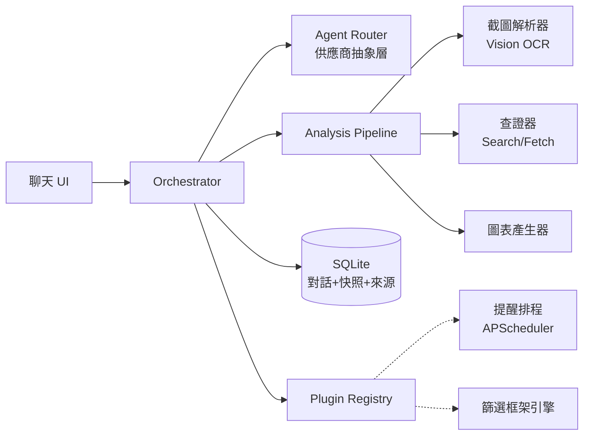
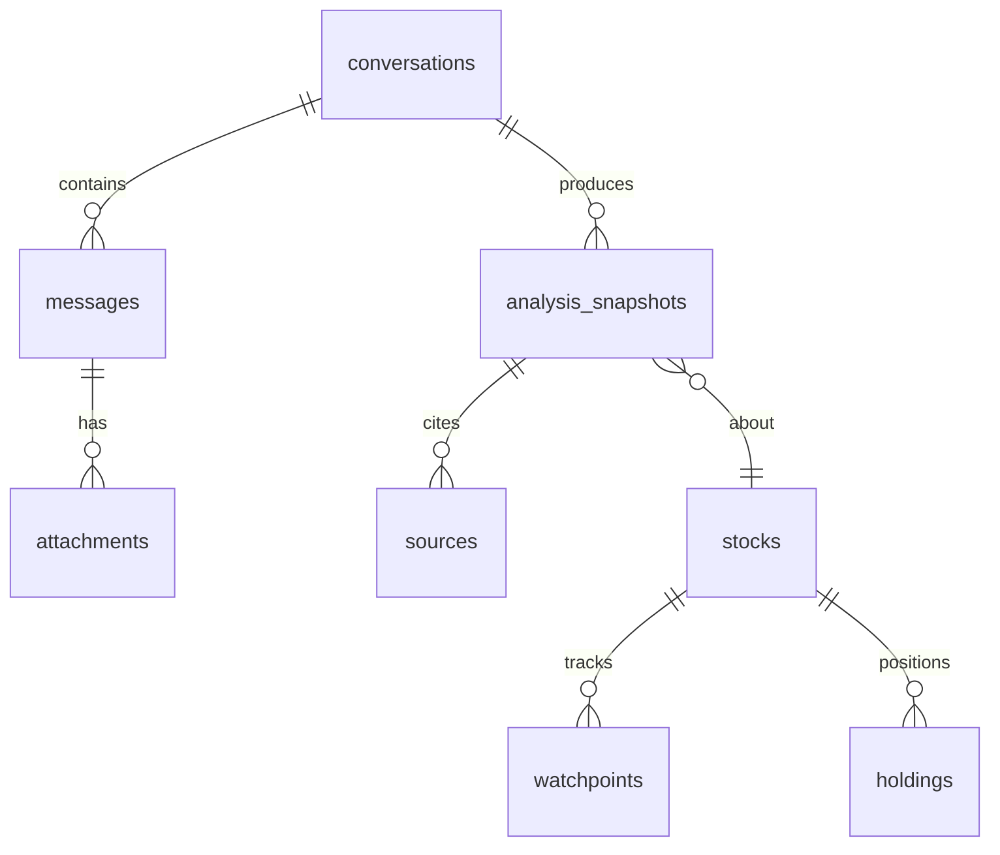

# 股市研究對話服務 — 補充需求建議書 (SRC-010)

> 來源：PO 於 Claude App（網頁版）實際使用後，與網頁版 Claude 討論萃取的
> 補充需求建議書，2026-07-09 交付地端 session。
> **注意**：本建議書撰寫時不知道 AlphaVibe 已定案的決策脈絡（Q-022 單一專案、
> Q-032 Claude+Cline 引擎、Q-010 持倉排除），文中「stock-research 既有技術棧／
> 現有多供應商配置」指涉的是已封存的 AI-stock-km-v1 形態。評估意見與採納決策
> 另見 clarification-log（Q-034 起）。以下為原文照錄。

---

> 交付對象：地端 Claude Fable 5（Architect）
> 來源：Claude App 對話實務流程萃取（2026-07-09）
> 定位：對既有需求文件的「補充」，聚焦三大目標：可追溯資料庫、多 Agent 切換、持續擴充

## 1. Purpose（目的）

把「上傳持股截圖 → 查證 → 分析 → 畫圖 → 沉澱判斷框架」這條在 Claude App 中手動跑的流程，
產品化為地端服務，並解決三個核心問題：

1. **追溯性**：每次分析的結論、引用來源、當時股價都會過期，必須以「快照」形式入庫，日後可 diff。
2. **Agent 可替換**：分析邏輯不綁定單一模型，透過抽象層切換 Claude / Gemini / OpenAI / Ollama。
3. **可擴充**：新功能（選股器、提醒、回測）以 plugin 形式掛入，不動核心。

## 2. Target（環境）

- 後端：FastAPI + SQLite（沿用 stock-research 既有技術棧與 `core/` 分層原則）
- 前端：Vanilla JS 聊天介面（可先極簡，重點在資料層）
- 部署：Mac Mini 地端優先，保留 Oracle Cloud 同步選項
- Agent 供應商：Anthropic API / Gemini / OpenAI / Ollama / OpenRouter（沿用現有多供應商配置）

## 3. Components(模組)



### 3.1 資料層（追溯性核心）



| 資料表 | 關鍵欄位 | 設計理由 |
|---|---|---|
| `conversations` | id, title, agent_used, created_at | 對話為最小追溯單位 |
| `messages` | conv_id, role, content, model_id, token_usage | 記錄「哪個模型說的」，切換 Agent 後可比對品質 |
| `attachments` | msg_id, file_path, parsed_json | 截圖原檔 + 解析後結構化結果都留存 |
| `stocks` | ticker, name, market | 主檔 |
| `holdings` | ticker, shares, avg_cost, snapshot_date | 從截圖解析入庫，隨時間累積成部位歷史 |
| `analysis_snapshots` | ticker, snapshot_date, price_at_time, pe_at_time, thesis_json, risk_json | **核心表**：把「當時的結論」凍結，日後 diff 用 |
| `sources` | snapshot_id, url, title, retrieved_at, quote_summary | 每個結論附引用來源與擷取時間，防資訊過期誤判 |
| `watchpoints` | ticker, event_type, due_date, note, status | 除權息日、法說會日、月營收公告日 |

> **設計原則**：股市資料天生會過期。任何分析結論若不綁定「當時價格 + 當時來源 + 擷取日期」，
> 三個月後回看就是雜訊。`analysis_snapshots` 是本系統與一般聊天存檔的最大差異。

### 3.2 Agent Router（多模型切換）

- 介面統一為 `send(messages, tools, model_profile) -> response`
- `model_profile` 以 YAML/JSON 設定檔管理，欄位：provider、model_id、max_tokens、cost_tier、capabilities（vision / search / tool_use）
- **能力降級策略**：若切換到不支援 vision 的模型（如部分 Ollama 本地模型），截圖解析 fallback 到獨立 OCR 模組，不阻斷主流程
- 每則 message 記錄實際使用的 model_id（見資料表），支援日後 A/B 比較不同 Agent 的分析品質

### 3.3 Analysis Pipeline（對話實務流程的固化）

依 Claude App 實測流程拆為五個可獨立呼叫的 stage：

1. **parse_holdings**：截圖 → {ticker, shares, avg_cost, pnl} 結構化資料 → 寫入 `holdings`
2. **verify**：對 ticker 執行查證（現價、月營收、法說會摘要、除權息日）→ 寫入 `sources`
3. **analyze**：產出「驅動因素 / 下檔風險 / 後續關注點」三段式結論 → 寫入 `analysis_snapshots`
4. **chart**：成本 vs 股價關鍵點位對照圖（前端以 Chart.js 渲染，沿用既有經驗）
5. **screen**：套用沉澱的篩選框架（見 3.4）

每個 stage 皆可單獨重跑（例如只更新 verify 不重做 analyze），符合短 session、低 token 的工作紀律。

### 3.4 篩選框架引擎（本次對話沉澱的判斷邏輯）

以設定檔定義、可版本化的 checklist，初始版本：

```yaml
framework_v1:
  fundamental:
    - id: growth_engine_concrete   # 成長引擎是否具體（非 2 年後的遠期題材）
    - id: guidance_direction        # 財測方向是否上修（下修 = 一票否決警訊）
    - id: revenue_price_sync        # 營收與股價是否同步創高（背離 = 警訊）
  technical:
    - id: ma_alignment              # 日月季線多頭排列或糾結向上
    - id: volume_price_match        # 量價配合
    - id: higher_lows               # 低點是否墊高
  valuation:
    - id: pe_percentile             # 本益比位於歷史河流圖哪個區間
    - id: implied_growth_gap        # 法人目標價 vs 現價折溢價（隱含空間反推）
```

每次 analyze 產出的 snapshot 記錄「當時用的是哪個 framework 版本」，框架演進本身也可追溯。

## 4. Function（各模組行為細節）

### 4.1 查證器資料來源優先序（實測驗證過的來源）

| 資料類型 | 首選來源 | 備援 |
|---|---|---|
| 即時股價 | Yahoo 股市 / TWSE OpenAPI | Goodinfo |
| 月營收 | 公開資訊觀測站 MOPS | 財報狗、Win 投資 |
| 法說會摘要 | 富果直送 blog | 公司官網 IR |
| 除權息 | Goodinfo 行事曆 | nStock |
| 公告事件 | Goodinfo 個股頁公告串 | MOPS |

> 建議 Phase 1 先用 agent 的 web search 工具即可；Phase 2 再針對 TWSE/MOPS 官方 API 寫爬取模組，減少搜尋 token 開銷。

### 4.2 Watchpoint 提醒

- APScheduler 排程（沿用 stock-research 既有元件）
- 事件到期 → 推播（沿用 Claude Code 原生通知的既有整合）→ 自動觸發該 ticker 的 verify stage，把最新狀態寫入新 snapshot

### 4.3 Diff 檢視（追溯性的實際用途）

- 給定 ticker，列出歷次 snapshot 的 thesis/risk/價格/本益比變化
- 典型用例：「我 6/18 買鴻勁時的判斷 vs 今天的事實」——這是手動聊天做不到、入庫後才可能的功能

## 5. Roadmap（開發階段建議）

| Phase | 範圍 | 驗收標準 |
|---|---|---|
| P0 | 資料層 schema + 對話 CRUD + 單一 Agent（Anthropic） | 對話入庫、可查詢歷史 |
| P1 | Agent Router + model_profile 設定檔 | 同一對話中切換模型且訊息標記 model_id |
| P2 | parse_holdings + verify + analyze 三個 stage | 上傳截圖跑完整分析並產生 snapshot |
| P3 | 篩選框架引擎 + chart | framework_v1 可對任一 ticker 出 checklist 報告 |
| P4 | watchpoints + 排程 + diff 檢視 | 除權息前自動提醒並更新 snapshot |

## 6. 工程約束（沿用既有紀律）

- `core/` 業務邏輯與 FastAPI 路由層隔離；SQLite 介面抽象化保留 Redis 遷移路徑
- 每個 Phase 完成後更新 SPEC.md / ARCH.md，per-module context_snippet.md 而非巨型 CLAUDE.md
- Token 成本控管：verify stage 的搜尋次數設上限（單 ticker 單次 ≤ 3 查詢）；snapshot 產生後優先讀庫、不重複查證
- 免責定位：系統輸出為研究輔助資訊，非投資建議；UI 需固定顯示此聲明
