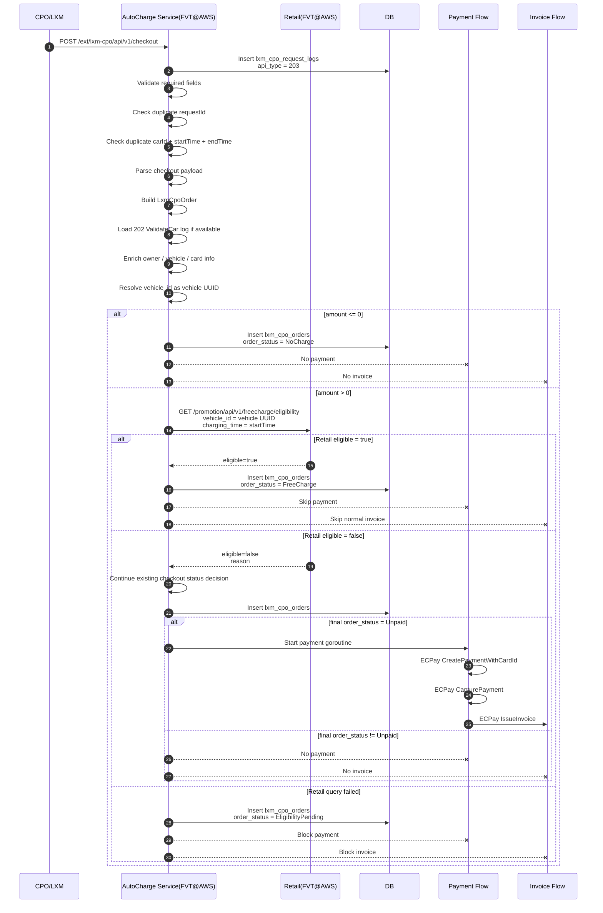

# FreeCharge Campaign - AutoCharge Service Implementation Specification

## 1. Document Objective

This document defines the implementation specification for the FreeCharge Campaign in the AutoCharge Service (FVT@AWS).

The source of FreeCharge eligibility is Retail (FVT@AWS). The AutoCharge Service does not determine whether a vehicle is eligible for FreeCharge by itself.

The responsibility of the AutoCharge Service is to call the Retail eligibility API before creating a CPO charging order, determine whether the charging order should be marked as FreeCharge based on the Retail response, and control the subsequent payment and invoice flow.

The `202` and `203` mentioned in this document are existing AutoCharge CPO API flow markers:

```text
202 = lxm_cpo_request_logs.api_type = ValidateCar
203 = lxm_cpo_request_logs.api_type = Checkout
```

They are not FreeCharge statuses and are not order statuses.

## 2. Scope

### 2.1 In Scope

| Area | Description |
| --- | --- |
| AutoCharge FreeCharge decision | AutoCharge calls the Retail eligibility API before creating a CPO order. |
| Existing CPO flow mapping | Map the FreeCharge logic into the existing 202 / 203 flow. |
| 203 Checkout integration | Perform the FreeCharge eligibility check before creating the checkout order and before triggering payment. |
| Order status assignment | Support order-level statuses such as FreeCharge and EligibilityPending. |
| Payment bypass | FreeCharge orders do not create payment requests and do not charge credit cards. |
| Invoice bypass | FreeCharge orders do not enter the normal non-zero invoice flow. |
| Pending strategy | When the Retail eligibility query fails, create a pending order, block payment and invoice, and retry later. |
| Payment / invoice guard | Ensure only Unpaid orders can enter the payment flow. |

### 2.2 Out of Scope

| Area | Owner |
| --- | --- |
| FreeCharge eligibility creation | Retail |
| `has_promotions` creation / update | Retail |
| Remote Control activation event | Retail |
| DMS `/getSaleOrder` query | Retail |
| DMS f16 sales category judgment | Retail |
| Offline eligibility manual import | Retail / Business Unit |
| APP promotion status display | Retail / APP |
| Final tax treatment | Finance / Tax |
| FreeCharge trace table | Deferred |
| FreeCharge campaign traceability fields | Deferred |
| Persisting `has_promotion_id` | Deferred |
| Persisting `campaign_id` | Deferred |
| Persisting `promotion_id` | Deferred |

The AutoCharge Service is not responsible for determining vehicle sales category, querying DMS, or creating promotion qualifications.

The original requirement defines Retail as the source of truth for FreeCharge eligibility. AutoCharge only queries Retail eligibility during CPO runtime.

## 3. Terminology

### 3.1 Existing AutoCharge Terms

| Term | Meaning |
| --- | --- |
| `lxm_cpo_request_logs` | LXM / CPO request log table |
| `api_type = 202` | ValidateCar request log |
| `api_type = 203` | Checkout request log |
| `lxm_cpo_orders` | CPO order created by 203 Checkout |
| `order_status` | Order status in `lxm_cpo_orders`; not equal to `api_type` |
| Unpaid | Existing payable status. Only this status triggers the payment flow. |
| NoCharge | Existing no-payment status for `amount <= 0`. |
| FreeCharge | New or mapped FreeCharge order-level status. |
| EligibilityPending | New or mapped temporary order-level status when the Retail eligibility query fails. |

### 3.2 Vehicle Identifier

In this specification, `vehicle_id` means the vehicle UUID used by the Retail eligibility API.

Example:

```text
98408b0e-e235-41ff-9698-729138a39d39
```

`vehicle_id` is not VIN.

`vehicle_id` is not `car_no`.

VIN, `car_no`, or `carId` may only be used by AutoCharge as internal lookup data to resolve the vehicle UUID if needed. They must not be sent to the Retail FreeCharge eligibility API as `vehicle_id`.

### 3.3 Important Distinction

The following two concepts must not be mixed:

```text
lxm_cpo_request_logs.api_type
  202 = ValidateCar
  203 = Checkout
```

Different from:

```text
lxm_cpo_orders.order_status
  NoCharge
  OwnerNotFound
  NoBoundCards
  Unpaid
  Paid
  FreeCharge
  EligibilityPending
```

The FreeCharge implementation affects the order-level decision created during 203 Checkout.

It does not change the meaning of `api_type = 202 / 203`.

## 4. Existing AutoCharge Flow Context

### 4.1 Existing 202 ValidateCar

Endpoint:

```http
POST /ext/lxm-cpo/api/v1/validate/car
```

Existing purpose:

202 is the pre-charging validation flow. It is used to verify whether a vehicle can start AutoCharge.

Existing behavior:

```text
CPO/LXM calls validate/car
-> create lxm_cpo_request_logs, api_type = 202
-> validate required fields
-> check CPO clientId / envType
-> call TSP to query vehicle owner
-> update vehicle data
-> check ownerUserId
-> query user
-> query bound credit card
-> check card expiry
-> check AutoCharge enabled
-> check unpaid orders
-> update request log response
-> return success or error code
```

202 does not:

- create `lxm_cpo_orders`
- trigger payment
- trigger invoice

FreeCharge impact on 202:

In this version, 202 ValidateCar is not the formal FreeCharge decision point.

Reasons:

- 202 happens before charging and does not yet have the final charging amount.
- 202 does not create an order.
- The core FreeCharge requirement is to determine whether payment should be waived before the CPO order is created.
- The actual order creation point is 203 Checkout.
- 203 is the point where the payment / invoice decision is made.

If the business later requires FreeCharge vehicles to start charging even without a bound credit card, an additional FreeCharge precheck may need to be added to 202.

This item is treated as an open issue and is not required in the current version.

### 4.2 Existing 203 Checkout

Endpoint:

```http
POST /ext/lxm-cpo/api/v1/checkout
```

Existing purpose:

203 is the post-charging checkout flow. It creates the CPO order and starts payment and invoice flows depending on the order status.

Existing behavior:

```text
CPO/LXM calls checkout
-> create lxm_cpo_request_logs, api_type = 203
-> validate required fields
-> check duplicated requestId
-> check duplicated carId + startTime + endTime
-> parse startTime / endTime / usedEnergy / amount / location
-> build LxmCpoOrder object
-> try to find 202 log by same requestId
-> if 202 exists, copy owner / vehicle / card info
-> if 202 does not exist, fallback query TSP / user / card / unpaid order
-> decide order status
-> create lxm_cpo_orders
-> if order_status = Unpaid, start payment flow
```

Existing payment rule:

Only `order_status = Unpaid` triggers payment.

Existing payment flow:

```text
Unpaid
-> background goroutine
-> ECPay CreatePaymentWithCardId
-> success: order_status = Paid
-> ECPay CapturePayment
-> ECPay IssueInvoice
```

## 5. FreeCharge Target Design

### 5.1 Core Principle

FreeCharge is an order-level payment decision.

The AutoCharge Service should query Retail during 203 Checkout before the following actions:

- before final `order_status` is persisted as Unpaid
- before payment goroutine starts
- before invoice flow can be triggered

Actual integration point:

```text
203 Checkout
-> parse checkout payload
-> build / enrich LxmCpoOrder
-> resolve vehicle_id as vehicle UUID
-> before SaveOrder and before payment dispatch
-> call Retail FreeCharge eligibility API
-> decide FreeCharge / Normal / EligibilityPending
```

### 5.2 FreeCharge Decision Source

The AutoCharge Service must call:

```http
GET /promotion/api/v1/freecharge/eligibility
```

This API is the AutoCharge-facing FreeCharge eligibility decision API.

The AutoCharge Service must not infer FreeCharge eligibility by itself from the following data:

- order type
- vehicle model
- payment amount
- DMS f16
- card status
- owner type
- 202 success or failure alone
- VIN alone
- `car_no` alone

### 5.3 No Traceability Storage in Current Version

In the current version, AutoCharge does not persist FreeCharge traceability data.

The following are not required in this version:

- FreeCharge trace table
- `eligibility_decision`
- `eligibility_reason`
- `eligibility_checked_at`
- `has_promotion_id`
- `campaign_id`
- `promotion_id`
- `retail_request_id`
- `retail_http_status`
- `retry_count`
- `last_retry_at`
- `resolved_at`

The minimum required implementation is to persist the final order-level status in `lxm_cpo_orders`.

Required logical statuses:

- FreeCharge
- EligibilityPending

## 6. Retail Eligibility API Contract

### 6.1 API

```http
GET /promotion/api/v1/freecharge/eligibility
```

### 6.2 Query Parameters

| Parameter | Required | Source in AutoCharge |
| --- | --- | --- |
| `vehicle_id` | Yes | Vehicle UUID resolved from the 202 log, vehicle data, or fallback lookup |
| `charging_time` | Yes | Charging start time, preferably 203 `startTime` |

Identifier rule:

- `vehicle_id` must be provided.
- `vehicle_id` must be a vehicle UUID.
- `vehicle_id` is not VIN.
- `vehicle_id` is not `car_no`.

Recommended usage:

```text
vehicle_id = vehicle UUID
charging_time = 203 Checkout startTime
```

Example `vehicle_id`:

```text
98408b0e-e235-41ff-9698-729138a39d39
```

Reason:

- Retail FreeCharge eligibility is evaluated by vehicle UUID and charging time.
- FreeCharge eligibility should be evaluated by the actual charging time.
- Retail evaluates the eligibility period based on the following rule:

```text
my_start_time <= charging_time < my_end_time
```

If the final `charging_time` source needs to follow Retail's original requirement strictly, it should be confirmed between AutoCharge and Retail.

### 6.3 Request Example

```http
GET /promotion/api/v1/freecharge/eligibility?vehicle_id=98408b0e-e235-41ff-9698-729138a39d39&charging_time=2026-05-27T16:00:00Z
```

### 6.4 Eligible Response

Example:

```json
{
  "eligible": true,
  "vehicle_id": "98408b0e-e235-41ff-9698-729138a39d39",
  "my_start_time": "2026-05-27T16:00:00Z",
  "my_end_time": "2026-05-27T16:00:50Z",
  "eligibility_source": "AUTO_DMS_SALES_ORDER",
  "reason": null
}
```

AutoCharge action:

- `order_status = FreeCharge`
- create `lxm_cpo_orders`
- skip payment
- skip normal invoice
- AutoCharge does not persist campaign traceability fields in the current version.

### 6.5 Not Eligible Response

Example:

```json
{
  "eligible": false,
  "vehicle_id": "98408b0e-e235-41ff-9698-729138a39d39",
  "reason": "NO_ACTIVE_FREECHARGE_PROMOTION"
}
```

AutoCharge action:

- continue existing 203 checkout logic
- existing statuses are still determined by the existing logic
- only the final status below triggers payment:

```text
Unpaid
```

### 6.6 Retail Query Failure

Failure cases:

- timeout
- network error
- Retail 5xx
- connection refused
- response parse failed
- Retail temporarily unavailable

AutoCharge action:

- `order_status = EligibilityPending`
- create `lxm_cpo_orders`
- do not start payment
- do not issue invoice
- schedule retry

This fail-pending strategy prevents AutoCharge from incorrectly charging a vehicle that may be eligible for FreeCharge.

## 7. Functional Requirements

### FR-AC-001 - Preserve Existing 202 ValidateCar Behavior

The AutoCharge Service shall preserve the current 202 ValidateCar behavior.

202 shall:

- create `lxm_cpo_request_logs` with `api_type = 202`
- perform existing validation
- return success or existing error code
- not create `lxm_cpo_orders`
- not trigger payment
- not trigger invoice

The final FreeCharge decision shall not be made in 202 in this version.

### FR-AC-002 - Preserve Existing 203 Checkout Entry Behavior

The AutoCharge Service shall preserve the current 203 Checkout entry behavior.

203 shall:

- create `lxm_cpo_request_logs` with `api_type = 203`
- validate required fields
- check duplicated `requestId`
- check duplicated `carId + startTime + endTime`
- parse checkout payload
- build `LxmCpoOrder` object
- load 202 request log if available
- fallback query owner / vehicle / card if 202 log is unavailable

### FR-AC-003 - Resolve Vehicle UUID Before FreeCharge Eligibility Check

For 203 Checkout, AutoCharge shall resolve `vehicle_id` before calling the Retail FreeCharge eligibility API.

`vehicle_id` must be the vehicle UUID.

Example:

```text
98408b0e-e235-41ff-9698-729138a39d39
```

AutoCharge shall not send VIN or `car_no` as `vehicle_id`.

VIN, `car_no`, or `carId` may only be used as internal lookup data to resolve the vehicle UUID.

### FR-AC-004 - Perform FreeCharge Eligibility Check in 203

For 203 Checkout, when all of the following conditions are true:

- `amount > 0`
- `vehicle_id` is available
- order is not duplicate
- checkout payload is valid

The AutoCharge Service shall call:

```http
GET /promotion/api/v1/freecharge/eligibility
```

With:

```text
vehicle_id = vehicle UUID
charging_time = charging start time
```

The call must happen before the order is finalized as Unpaid and before the payment flow starts.

### FR-AC-005 - Handle FreeCharge Eligible Order

If Retail returns:

```json
{
  "eligible": true
}
```

The AutoCharge Service shall:

- set `order_status = FreeCharge`
- create `lxm_cpo_orders`
- not start payment goroutine
- not call ECPay `CreatePaymentWithCardId`
- not call ECPay `CapturePayment`
- not call normal `IssueInvoice`

In the current version, AutoCharge does not store FreeCharge traceability data returned by Retail.

### FR-AC-006 - Handle FreeCharge Not Eligible Order

If Retail returns:

```json
{
  "eligible": false
}
```

The AutoCharge Service shall continue existing 203 checkout order-status decision.

Existing behavior remains:

- OwnerNotFound -> no payment
- NoBoundCards -> no payment
- Unpaid -> start payment

### FR-AC-007 - Handle Retail Eligibility Query Failure

If the Retail eligibility API fails, the AutoCharge Service shall:

- set `order_status = EligibilityPending`
- create `lxm_cpo_orders`
- not start payment
- not issue invoice
- wait for pending resolution worker

### FR-AC-008 - Preserve Existing NoCharge Behavior

If:

```text
amount <= 0
```

The AutoCharge Service shall keep the existing behavior:

- `order_status = NoCharge`
- no payment
- no invoice

The AutoCharge Service does not need to call the Retail eligibility API when `amount <= 0`.

Reason:

- NoCharge means the charging amount itself is zero or non-positive.
- FreeCharge means the amount is positive, but payment is waived due to campaign eligibility.
- These two statuses must not be merged.

### FR-AC-009 - Payment Flow Guard

The payment flow shall only start when:

```text
order_status = Unpaid
```

The payment entry point must explicitly reject or ignore:

- FreeCharge
- EligibilityPending
- NoCharge
- OwnerNotFound
- NoBoundCards
- Paid

Suggested guard:

```go
if order.Status != OrderStatusUnpaid {
    return
}
```

### FR-AC-010 - Invoice Flow Guard

The normal invoice flow shall not run for:

- FreeCharge
- EligibilityPending
- NoCharge
- OwnerNotFound
- NoBoundCards

Suggested guard:

```go
if order.Status == OrderStatusFreeCharge ||
   order.Status == OrderStatusEligibilityPending {
    return
}
```

If Finance / Tax later requires a zero-amount invoice for FreeCharge, it must be implemented as a separate FreeCharge invoice mode and must not reuse the existing normal non-zero invoice flow.

## 8. Adjusted 203 Checkout Flow

### 8.1 Logical Flow

```text
CPO/LXM calls POST /ext/lxm-cpo/api/v1/checkout
-> create request log, api_type = 203
-> validate request
-> check duplicate requestId
-> check duplicate carId + startTime + endTime
-> parse startTime / endTime / amount / usedEnergy / location
-> build LxmCpoOrder object
-> load 202 ValidateCar log if available
-> enrich owner / vehicle / card from 202 log or fallback lookup
-> resolve vehicle_id as vehicle UUID
-> if amount <= 0:
     order_status = NoCharge
     save order
     no payment
     no invoice
-> else amount > 0:
     call Retail FreeCharge eligibility API with vehicle_id / charging_time
     -> eligible:
          order_status = FreeCharge
          save order
          no payment
          no normal invoice
     -> not eligible:
          continue existing checkout logic
          save order
          if final order_status = Unpaid:
              start payment
     -> query failed:
          order_status = EligibilityPending
          save order
          no payment
          no invoice
          retry later
```

### 8.2 Mermaid Sequence



## 9. Order Status Design

### 9.1 Existing Statuses

| Status | Meaning | Payment |
| --- | --- | --- |
| NoCharge | `amount <= 0` | No |
| OwnerNotFound | Vehicle owner not found | No |
| NoBoundCards | No bound credit card | No |
| Unpaid | Pending payment | Yes |
| Paid | Paid | No new payment |

### 9.2 New Logical Statuses

| Status | Meaning | Payment | Invoice |
| --- | --- | --- | --- |
| FreeCharge | Retail determines that this CPO order is eligible for FreeCharge | No | No normal invoice |
| EligibilityPending | Retail eligibility query failed and is waiting for resolution | No | No |

The physical enum value is to be confirmed.

Important:

```text
Do not use 202 or 203 as order_status.
```

### 9.3 Status Decision Matrix

| Condition | Final Action |
| --- | --- |
| Invalid checkout request | Return error and update 203 request log |
| Duplicate requestId | Return existing result and do not create duplicate order |
| Duplicate `carId + startTime + endTime` | Return existing result and do not create duplicate order |
| `amount <= 0` | `order_status = NoCharge` |
| `amount > 0` and `vehicle_id` is available and Retail eligible | `order_status = FreeCharge` |
| `amount > 0` and `vehicle_id` is available and Retail not eligible | Continue existing checkout logic |
| `amount > 0` and Retail query failed | `order_status = EligibilityPending` |
| `amount > 0` but `vehicle_id` cannot be resolved | Continue existing checkout logic |
| Existing logic result = Unpaid | Start payment |
| Existing logic result != Unpaid | No payment |

## 10. Data Model

### 10.1 Do Not Change

Do not change the meaning of:

```text
lxm_cpo_request_logs.api_type
```

It remains:

```text
202 = ValidateCar
203 = Checkout
```

### 10.2 No Trace Table in Current Version

In the current version, AutoCharge does not create a dedicated FreeCharge trace table.

The following table is not required in this version:

```text
lxm_cpo_order_freecharge_traces
```

The following fields are also not required in this version:

- `eligibility_decision`
- `eligibility_reason`
- `eligibility_checked_at`
- `has_promotion_id`
- `campaign_id`
- `promotion_id`
- `retail_request_id`
- `retail_http_status`
- `retry_count`
- `last_retry_at`
- `resolved_at`

### 10.3 Minimum Required Data Change

The minimum required implementation is to support the final order-level statuses in `lxm_cpo_orders`.

Required logical statuses:

- FreeCharge
- EligibilityPending

The physical enum values or database status values must be confirmed with the existing AutoCharge implementation.

No additional FreeCharge traceability columns are required in the current version.

## 11. Idempotency

### 11.1 202 Request Log

Existing behavior remains.

202 creates request log only.

202 does not create order.

### 11.2 203 Checkout Order Creation

The AutoCharge Service shall prevent duplicate order creation by the existing keys:

- `requestId`
- `carId + startTime + endTime`

If a duplicate is detected:

- do not call Retail eligibility again unless the existing order status is incomplete or unresolved
- do not create duplicate `lxm_cpo_orders`
- return existing checkout result

### 11.3 Pending Resolution

For EligibilityPending orders:

- retry must update the existing `lxm_cpo_orders` record
- retry must not insert a new order

Suggested logical key:

```text
lxm_cpo_order_id
```

## 12. Pending Resolution

### 12.1 Job Purpose

A worker shall retry orders where:

```text
order_status = EligibilityPending
```

Because trace storage is not included in the current version, the worker must read the required vehicle and charging information from the existing order or related request log.

### 12.2 Worker Flow

```text
Find EligibilityPending orders
-> read vehicle_id / charging_time from the existing order or related request log
-> call Retail eligibility API
-> if eligible:
     update order_status = FreeCharge
     keep payment skipped
     keep normal invoice skipped
-> if not eligible:
     continue existing checkout status decision if enough data exists
     if resolved status = Unpaid:
         start payment flow
     else:
         no payment
-> if query fails again:
     keep order_status = EligibilityPending
     alert if retry threshold is exceeded
```

### 12.3 Pending Resolution Rule

Pending resolution shall not create a new CPO order.

It must update:

```text
existing lxm_cpo_orders
```

### 12.4 Pending Retry Limitation in Current Version

Since the current version does not include a FreeCharge trace table or retry metadata fields, retry count and retry history are not persisted in a dedicated FreeCharge trace table.

If retry count is required, it must be implemented through one of the following options:

- existing job execution logs
- existing order update metadata
- external scheduler metadata
- future trace table
- future retry metadata columns

The exact retry tracking mechanism is an open issue.

## 13. Payment and Invoice Control

### 13.1 Payment Rule

The payment flow can start only when:

```text
order_status = Unpaid
```

It must not start for:

- FreeCharge
- EligibilityPending
- NoCharge
- OwnerNotFound
- NoBoundCards
- Paid

### 13.2 Invoice Rule

The normal invoice flow can only happen after the normal paid flow.

A FreeCharge order must not trigger:

```text
normal non-zero invoice
```

Default behavior:

```text
skip invoice issuance for FreeCharge
```

Open issue:

```text
Finance / Tax must confirm whether FreeCharge requires a zero-amount invoice.
```

If a zero-amount invoice is required, implement a separate flow:

```text
FreeChargeZeroAmountInvoice
```

Do not blindly reuse the normal invoice flow.

## 14. Error Handling

### 14.1 Retail Eligibility Query Error

| Case | Handling |
| --- | --- |
| Timeout | EligibilityPending |
| Retail 5xx | EligibilityPending |
| Network error | EligibilityPending |
| Connection refused | EligibilityPending |
| Response parse failed | EligibilityPending |
| Retail temporarily unavailable | EligibilityPending |
| Retail 4xx caused by missing or invalid `vehicle_id` | Continue existing flow or mark abnormal based on current validation rule |

### 14.2 Missing Vehicle Identifier

If 203 Checkout cannot resolve:

```text
vehicle_id
```

where `vehicle_id` means the vehicle UUID, AutoCharge cannot call the Retail eligibility API.

Recommended handling:

- continue existing 203 checkout logic
- do not mark as FreeCharge

In the current version, AutoCharge does not persist `eligibility_decision = NOT_CHECKED` because traceability storage is out of scope.

VIN, `car_no`, or `carId` may be used only as internal lookup data to resolve the vehicle UUID. They are not valid replacements for `vehicle_id` in the Retail eligibility API request.

### 14.3 FreeCharge Payment Leakage

If an order with:

```text
order_status = FreeCharge
```

enters the payment flow:

- raise alert
- stop payment if possible
- mark reconciliation required

### 14.4 FreeCharge Invoice Leakage

If an order with:

```text
order_status = FreeCharge
```

enters the normal invoice flow:

- raise alert
- stop invoice if possible
- mark reconciliation required

### 14.5 EligibilityPending Payment Leakage

If an order with:

```text
order_status = EligibilityPending
```

enters the payment flow:

- raise alert
- stop payment if possible
- mark reconciliation required

### 14.6 EligibilityPending Invoice Leakage

If an order with:

```text
order_status = EligibilityPending
```

enters the normal invoice flow:

- raise alert
- stop invoice if possible
- mark reconciliation required

## 15. Reconciliation

In the current version, reconciliation only focuses on payment and invoice leakage.

| Check | Purpose |
| --- | --- |
| FreeCharge order entered payment | Detect payment bypass failure |
| FreeCharge order entered normal invoice | Detect invoice bypass failure |
| EligibilityPending order entered payment | Detect payment guard failure |
| EligibilityPending order entered normal invoice | Detect invoice guard failure |
| EligibilityPending older than threshold | Detect stuck orders |
| EligibilityPending retry exceeded | Manual handling |

The following traceability-based reconciliation checks are not included in the current version:

- FreeCharge order missing `has_promotion_id`
- FreeCharge order missing `campaign_id` / `promotion_id`
- FreeCharge order has `amount > 0` but no trace
- FreeCharge order missing `eligibility_decision`

## 16. Acceptance Criteria

### AC-001 - 202 Remains Existing ValidateCar

Given CPO/LXM calls:

```http
POST /ext/lxm-cpo/api/v1/validate/car
```

Then AutoCharge shall create:

```text
lxm_cpo_request_logs.api_type = 202
```

And shall not create:

```text
lxm_cpo_orders
```

And shall not trigger payment or invoice.

### AC-002 - 203 Remains Checkout Entry Point

Given CPO/LXM calls:

```http
POST /ext/lxm-cpo/api/v1/checkout
```

Then AutoCharge shall create:

```text
lxm_cpo_request_logs.api_type = 203
```

And, if validation and duplicate checks pass, create:

```text
lxm_cpo_orders
```

### AC-003 - Vehicle UUID Is Used as `vehicle_id`

Given 203 Checkout needs to call the Retail FreeCharge eligibility API,

Then AutoCharge shall resolve:

```text
vehicle_id = vehicle UUID
```

Example:

```text
98408b0e-e235-41ff-9698-729138a39d39
```

And AutoCharge shall not send VIN or `car_no` as `vehicle_id`.

### AC-004 - FreeCharge Eligible Checkout

Given 203 Checkout receives a valid charging order,

And `amount > 0`,

And `vehicle_id` is available,

And Retail returns:

```json
{
  "eligible": true
}
```

Then AutoCharge shall create `lxm_cpo_orders` with:

```text
order_status = FreeCharge
```

And payment shall not start.

And the normal invoice shall not be issued.

In the current version, AutoCharge does not need to persist:

- `has_promotion_id`
- `campaign_id`
- `promotion_id`
- `eligibility_decision`
- `eligibility_reason`

### AC-005 - FreeCharge Not Eligible Checkout

Given 203 Checkout receives a valid charging order,

And `amount > 0`,

And `vehicle_id` is available,

And Retail returns:

```json
{
  "eligible": false
}
```

Then AutoCharge shall continue the existing checkout logic.

If the final status is:

```text
Unpaid
```

Then payment starts.

If the final status is not:

```text
Unpaid
```

Then payment does not start.

### AC-006 - Retail Eligibility Query Failure

Given 203 Checkout receives a valid charging order,

And `amount > 0`,

And `vehicle_id` is available,

And the Retail eligibility API fails,

Then AutoCharge shall create an order with:

```text
order_status = EligibilityPending
```

And payment shall not start.

And invoice shall not be issued.

And pending resolution shall retry later.

### AC-007 - Amount <= 0

Given 203 Checkout receives:

```text
amount <= 0
```

Then AutoCharge shall preserve existing behavior:

```text
order_status = NoCharge
```

And shall not call the payment flow.

Retail eligibility check is not required for this case.

### AC-008 - Missing Vehicle UUID

Given 203 Checkout receives a valid charging order,

And `amount > 0`,

But AutoCharge cannot resolve:

```text
vehicle_id
```

Then AutoCharge shall not call the Retail FreeCharge eligibility API.

And AutoCharge shall not mark the order as FreeCharge.

AutoCharge shall continue existing checkout logic or apply the existing abnormal handling rule, depending on the current AutoCharge validation design.

### AC-009 - Duplicate Checkout

Given CPO/LXM retries the same:

```text
requestId
```

or the same:

```text
carId + startTime + endTime
```

Then AutoCharge shall not create duplicate `lxm_cpo_orders`.

### AC-010 - Payment Guard

Given any order status other than:

```text
Unpaid
```

When the payment function is called,

Then the payment function shall return without calling ECPay.

### AC-011 - Invoice Guard

Given an order with:

```text
order_status = FreeCharge
```

or:

```text
order_status = EligibilityPending
```

When the normal invoice function is called,

Then the invoice function shall return without issuing a normal non-zero invoice.

## 17. Open Issues

| Item | Required Decision |
| --- | --- |
| FreeCharge physical order status value | Confirm existing enum / DB value |
| EligibilityPending physical order status value | Confirm existing enum / DB value |
| 202 FreeCharge precheck | Decide whether FreeCharge vehicles can start charging without a bound card or with unpaid orders |
| Retail API timeout | Define timeout value |
| Pending retry interval | Define retry interval |
| Pending retry threshold | Define retry threshold |
| Pending retry tracking | Define whether retry count is tracked by job logs, scheduler metadata, order metadata, or future trace table |
| Invoice policy | Skip invoice or issue zero-amount invoice |
| Charging time source | Confirm whether to use 203 `startTime` or 202 `ValidateCar.request_time` |
| Missing vehicle UUID | Define how AutoCharge resolves `vehicle_id` when only VIN, `car_no`, or `carId` is available |
| Existing response code mapping | Define how FreeCharge / EligibilityPending should respond to CPO/LXM |
| FreeCharge traceability | Deferred to a later version |

## 18. Final Implementation Summary

The core FreeCharge requirement is not to refactor 202 / 203, but to connect the FreeCharge decision to the correct point in the existing AutoCharge CPO flow.

Correct mapping:

```text
202 ValidateCar
= existing pre-charge validation
= api_type = 202
= request log only
= no order
= no payment
= not FreeCharge final decision point

203 Checkout
= existing post-charge checkout
= api_type = 203
= creates lxm_cpo_orders
= payment may start if order_status = Unpaid
= FreeCharge final decision point
```

Final FreeCharge behavior:

```text
203 Checkout
-> amount <= 0
   -> NoCharge
   -> no payment
-> amount > 0
   -> resolve vehicle_id as vehicle UUID
   -> call Retail eligibility API with vehicle_id / charging_time
-> Retail eligible = true
   -> order_status = FreeCharge
   -> no payment
   -> no normal invoice
-> Retail eligible = false
   -> continue existing 203 logic
   -> only Unpaid starts payment
-> Retail query failed
   -> order_status = EligibilityPending
   -> no payment
   -> no invoice
   -> retry later
-> vehicle_id cannot be resolved
   -> do not call Retail eligibility API
   -> do not mark as FreeCharge
   -> continue existing 203 logic or existing abnormal handling
```

Current version simplification:

- FreeCharge v1 focuses only on order-level payment control.
- It does not introduce a FreeCharge trace table.
- It does not persist Retail campaign traceability fields.
- It only updates the CPO order status to FreeCharge or EligibilityPending.
- Payment and invoice guards are the mandatory controls.

This keeps FreeCharge aligned with the original requirement while keeping the first implementation scope minimal and focused.
