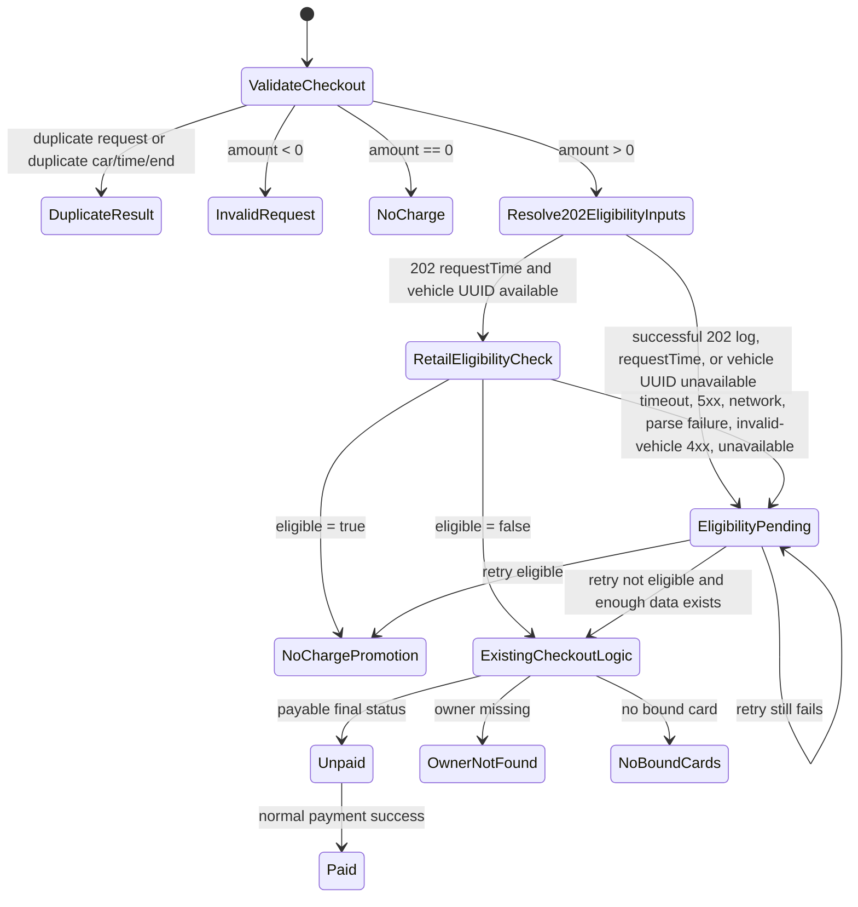

# Order State Model: AutoCharge FreeCharge

**Feature Slug:** autocharge-freecharge
**Last Updated:** 2026-05-12
**Status:** Complete

## Relevant Order Statuses

| Status | Meaning | Payment | Normal Invoice | Source |
|--------|---------|---------|----------------|--------|
| `NoCharge` | Existing status for `amount == 0`; negative amount is invalid input. | No | No | SRC-001, SRC-002 |
| `NoChargePromotion` | Existing status value `12` for promotion no-charge orders. This is the selected FreeCharge physical status. Current app displays promotion copy for this status. | No | No | SRC-002, SRC-003 |
| `OwnerNotFound` | Existing status when vehicle owner is not found. | No | No | SRC-001 |
| `NoBoundCards` | Existing status when no bound credit card exists. | No | No | SRC-001 |
| `Unpaid` | Existing payable status. | Yes | Through normal paid flow | SRC-001 |
| `Paid` | Existing paid status. | No new payment | Normal paid invoice rules apply | SRC-001 |
| FreeCharge logical status | Retail determines the positive-amount order is eligible for FreeCharge; store as `NoChargePromotion`. | No | No | SRC-001, SRC-002, SRC-003 |
| `EligibilityPending` | New status for Retail eligibility query failure awaiting retry. It is not unpaid debt, failed payment, outstanding payment, or a blocker for future 202 ValidateCar requests. | No | No | SRC-001, SRC-002, SRC-003, SRC-006 |

## Checkout State Transitions

## Idempotency Expectations

- Existing duplicate keys remain `requestId` and `carId + startTime + endTime`. [SRC-001]
- Current duplicate checkout response is `EC215`; preserve this behavior. [SRC-002, SRC-005]
- Duplicate checkout shall not create another `lxm_cpo_orders` record. [SRC-001]
- Duplicate checkout shall not call Retail again. [SRC-001, SRC-002, SRC-005]
- Pending retry shall update the existing CPO order and shall not create a new CPO order. [SRC-001]
- Existing 202/203 HTTP contracts shall not change. FreeCharge and `EligibilityPending` preserve the current 203 Checkout success response contract with original `data.amount`. [SRC-005]
- `EligibilityPending` shall not be added to 202 ValidateCar outstanding-payment, unpaid-debt, failed-payment, or equivalent blocker logic. [SRC-006]

## 202 ValidateCar Blocking Boundary

- 202 ValidateCar preserves its existing validation and blocker behavior. [SRC-001, SRC-005]
- A prior `EligibilityPending` FreeCharge order shall not cause 202 ValidateCar to fail for the same owner, vehicle, or account. [SRC-006]
- Stuck `EligibilityPending` resolution remains an operations/retry workflow and must not be converted into customer charging denial. [SRC-006]
- 202 may still fail for existing non-FreeCharge reasons such as no vehicle, no owner, no bound card, expired card, disabled AutoCharge, or actual unpaid/failed-payment statuses. [SRC-006]

## State Decisions

- `EligibilityPending` retry runs every 5 minutes and stops after 12 attempts or 60 minutes pending age. [SRC-005]
- Retail timestamp wire format is RFC3339 UTC derived from successful 202 `requestTime`; existing CPO/LXM timestamp fields remain epoch-millisecond strings. [SRC-005]
- Retail invalid-vehicle 4xx transitions to `EligibilityPending`, blocks payment and invoice, and alerts for recovery. [SRC-005]
- Existing `EligibilityPending` orders do not block later 202 ValidateCar requests. [SRC-006]
