# Workflow Sequence: AutoCharge FreeCharge

**Feature Slug:** autocharge-freecharge
**Last Updated:** 2026-05-12
**Status:** Complete

## 202 ValidateCar Context

202 ValidateCar remains an existing pre-charge validation flow. It creates a `lxm_cpo_request_logs` record with `api_type = 202`, runs existing validation, and does not create `lxm_cpo_orders`, trigger payment, or trigger invoice. [SRC-001]

A prior `EligibilityPending` FreeCharge order shall not block future 202 ValidateCar requests and shall not be treated as unpaid debt, failed payment, outstanding payment, or an equivalent 202 pre-charge blocker. Stuck `EligibilityPending` recovery remains separate operations/retry behavior. [SRC-006]

## 203 Checkout FreeCharge Flow

```mermaid
sequenceDiagram
    autonumber
    participant CPO as CPO/LXM
    participant AC as AutoCharge Service
    participant Retail as Retail
    participant DB as DB
    participant Pay as Payment Flow
    participant Invoice as Invoice Flow

    CPO ->> AC: POST /ext/lxm-cpo/api/v1/checkout
    AC ->> DB: Insert lxm_cpo_request_logs with api_type = 203
    AC ->> AC: Validate request and duplicate keys
    AC ->> AC: Parse checkout payload
    AC ->> AC: Build CPO order candidate
    alt amount < 0
        AC -->> CPO: Validation error per current 203 DTO
    else amount == 0
        AC ->> DB: Insert lxm_cpo_orders with status = NoCharge
        AC --x Pay: No payment
        AC --x Invoice: No normal invoice
    else amount > 0
        AC ->> DB: Read successful 202 ValidateCar request log
        AC ->> AC: Resolve vehicle_id and charging_time from 202 log
        alt 202 eligibility inputs available
            AC ->> Retail: GET /promotion/api/v1/freecharge/eligibility with vehicle_id and RFC3339 UTC charging_time derived from 202 requestTime
            alt eligible = true
                Retail -->> AC: eligible = true
                AC ->> DB: Insert lxm_cpo_orders with status = NoChargePromotion
                AC --x Pay: Skip payment
                AC --x Invoice: Skip normal invoice
            else eligible = false
                Retail -->> AC: eligible = false
                AC ->> AC: Continue existing checkout status decision
                AC ->> DB: Insert lxm_cpo_orders
                alt final status = Unpaid
                    AC ->> Pay: Start payment
                    Pay ->> Invoice: Issue invoice only through normal paid flow
                else final status != Unpaid
                    AC --x Pay: No payment
                    AC --x Invoice: No normal invoice
                end
            else Retail timeout, 5xx, network, parse failure, or invalid-vehicle 4xx
                AC ->> DB: Insert lxm_cpo_orders with status = EligibilityPending
                AC --x Pay: Block payment
                AC --x Invoice: Block invoice
            end
        else 202 eligibility inputs unavailable
            AC ->> DB: Insert lxm_cpo_orders with status = EligibilityPending
            AC --x Pay: Block payment
            AC --x Invoice: Block invoice
        end
    end
```



## Pending Resolution Flow

```mermaid
sequenceDiagram
    autonumber
    participant Worker as Pending Resolution Worker
    participant DB as DB
    participant Retail as Retail
    participant Pay as Payment Flow
    participant Ops as Operations

    Worker ->> DB: Find lxm_cpo_orders with status = EligibilityPending
    Worker ->> DB: Read vehicle_id and charging_time from successful 202 request log or approved equivalent
    Worker ->> Retail: Retry eligibility request every 5 minutes until 12 attempts or 60 minutes
    alt eligible = true
        Retail -->> Worker: eligible = true
        Worker ->> DB: Update existing status to NoChargePromotion
        Worker --x Pay: Keep payment skipped
    else eligible = false
        Retail -->> Worker: eligible = false
        Worker ->> Worker: Continue existing checkout status decision when enough data exists
        alt resolved status = Unpaid
            Worker ->> Pay: Start payment
        else resolved status != Unpaid
            Worker --x Pay: No payment
        end
    else query still fails or threshold exceeded
        Worker ->> DB: Keep EligibilityPending
        Worker ->> Ops: Warn after 30 minutes; manual recovery after 60 minutes or 12 failures
    end
```

## Flow Decisions

- Existing CPO/LXM 202 ValidateCar and 203 Checkout HTTP contracts must remain unchanged. FreeCharge and `EligibilityPending` 203 responses preserve HTTP 200, code `00`, message `success`, existing response schema, and original `data.amount`. [SRC-005]
- Retail timeout is 3 seconds in synchronous 203 Checkout with no inline retry. [SRC-005]
- Pending retry runs every 5 minutes until 12 attempts or 60 minutes pending age, whichever comes first. [SRC-005]
- Retail `charging_time` source is successful 202 request log `requestTime`, converted to RFC3339 UTC only for the Retail side-call. [SRC-004, SRC-005]
- Retail invalid-vehicle 4xx creates `EligibilityPending`, blocks payment and invoice, and alerts for recovery. [SRC-005]
- Existing `EligibilityPending` orders do not block later 202 ValidateCar requests. [SRC-006]
