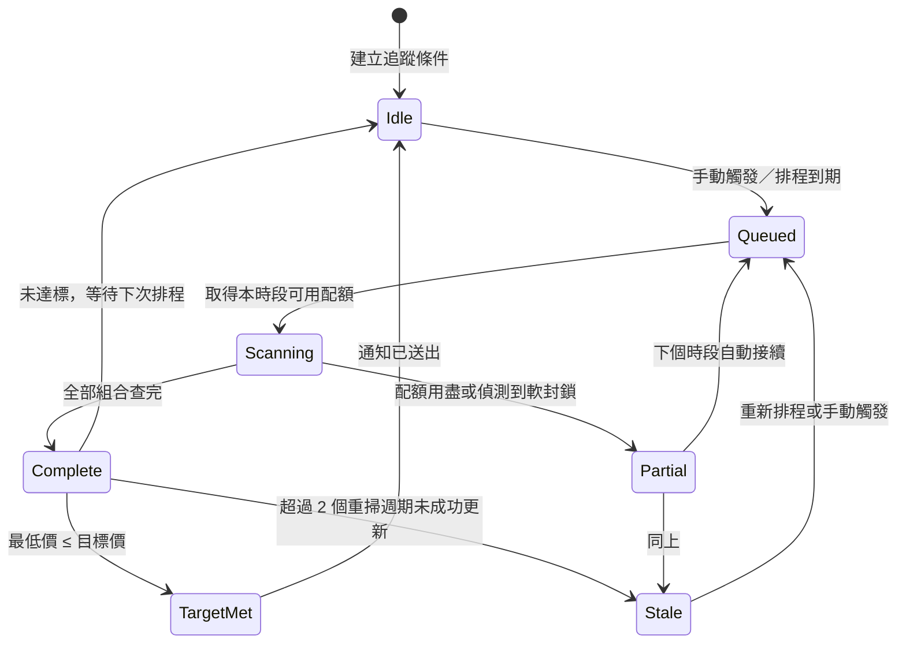
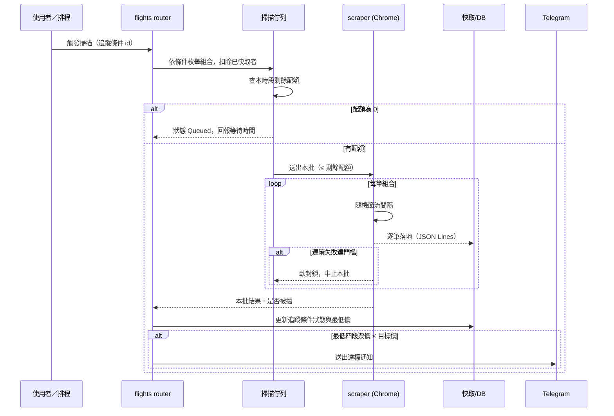

# 流程與狀態模型：機票查詢分頁

**Feature Slug:** flight-search
**Last Updated:** 2026-09-23
**對應 readiness check:** Multi-step workflow、Async job / state transition

## 為什麼需要這份文件

掃描不是「按一下、等一下、拿結果」。速率上限（實測 52 與 205 筆/小時
皆被擋，見研究筆記第 20 節）使一次掃描經常**無法在單一時段內完成**，
必須跨時段分批。因此「追蹤條件」有明確的生命週期，UI 與通知都依賴它。

## 追蹤條件狀態機

### 狀態定義

| 狀態 | 意義 | UI 呈現 |
|------|------|---------|
| Idle | 已建立，等待下次排程或手動觸發 | 顯示上次結果與更新時間 |
| Queued | 已排入佇列，等待速率配額釋出 | 「排隊中，約 N 分鐘後開始」 |
| Scanning | 正在查價 | 「掃描中 12/16」 |
| Partial | 本輪部分完成（配額用盡或被軟封鎖） | 「已完成 12/16，剩餘將於下個時段接續」＋原因 |
| Complete | 本輪全部查完 | 顯示排序結果與完成時間 |
| TargetMet | 最低四段票價 ≤ 目標價，已送出通知 | 達標標記＋通知時間 |
| Stale | 超過 2 個重掃週期未成功更新 | 「資料可能已過期（上次成功：日期）」 |

**Stale 的存在理由**：重掃可能連續失敗（被封鎖、網站改版）。若不標示，
使用者會把舊價當成現價。**Stale 狀態下不得以舊價觸發達標通知**
（CEB-06）。

## 掃描流程（單輪）

### 關鍵設計點

1. **先扣除已快取者**：同一組合已查過就不重查，這讓「跨時段接續」自然
   成立——第二批只會處理還沒查到的。
2. **逐筆落地**：每查完一筆立刻寫入，不等整批結束。中途當機或被 kill
   都不會丟失已完成結果（研究筆記第 15 節的實測教訓）。
3. **軟封鎖即中止**：連續失敗達門檻立即停止本批，不繼續打（繼續只會
   加深封鎖，第 14 節白打 16 次的教訓）。
4. **達標判定用四段票價**，不含接駁估價（Q-016 決定）。

## 多追蹤條件的排程錯開

預設重掃頻率為每週一次（Q-017）。多個追蹤條件必須**錯開到不同日**，
否則同一時段累積的查詢量會觸發速率上限。排程策略：依追蹤條件建立順序
分配到週一至週日，同一天最多一個條件。
